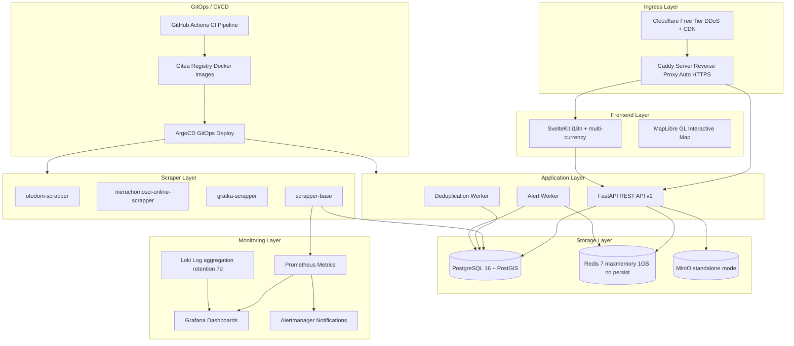

# Real Estate Aggregation Platform: Architecture Overview

> **Source:** Derived from `specs/020-ARCHITECTURE.md` and `specs/010-VISION.md`.

---

## 1. System Map



---

## 2. Tech Stack

| Layer | Technology | Purpose |
|-------|------------|---------|
| Backend | FastAPI + SQLAlchemy 2.0 async + Alembic | REST API, migrations |
| Database | PostgreSQL 16 + PostGIS | Property storage, spatial queries |
| Scraping | Scrapy + Playwright + BasePipeline | Portal scraping |
| Frontend | SvelteKit + TypeScript + MapLibre GL | Web UI, interactive map |
| Cache | Redis 7 (maxmemory 1GB, no persist) | API cache, streams |
| Storage | MinIO (standalone) | Photo storage, thumbnails |
| Monitoring | Prometheus + Grafana + Loki (7d) | Metrics, dashboards, logs |
| CI/CD | GitHub Actions + ArgoCD + Gitea | Automation, GitOps |
| Infra | k3s single node (→ cluster) | Container orchestration |

---

## 3. Data Flow

### 3.1 Scraping Pipeline

```
Portal HTML → Scrapy Spider → BasePipeline → PostgreSQL upsert
                                                   ↓
                                            Redis Stream (new_property)
                                                   ↓
                                            Alert Worker → Email/Push
```

### 3.2 Search API

```
Browser → SvelteKit → FastAPI → Redis (cache hit) → Response
                                    ↓ (cache miss)
                              PostgreSQL → Redis (set) → Response
```

### 3.3 Deduplication

```
Properties table → Stage 1: Blocking (city + type + price)
                → Stage 2: Heuristics (area/rooms/floor)
                → Stage 3: Fuzzy match (RapidFuzz ≥ 0.85)
                → Stage 4: Image phash (optional)
                → duplicate_groups + canonical_properties MV
```

---

## 4. Deployment Architecture

Single k3s node (MVP) with namespaces:

| Namespace | Components |
|-----------|------------|
| `scraper-ns` | Otodom, Nieruchomości Online, Dedup CronJobs |
| `app-ns` | FastAPI (1 replica), SvelteKit (1 replica) |
| `storage-ns` | PostgreSQL, Redis, MinIO |
| `monitoring-ns` | Prometheus, Grafana, Loki, Alertmanager |
| `gitops-ns` | ArgoCD, Gitea |

### Local Development Ports

| Service | Port |
|---------|------|
| FastAPI | 8000 |
| SvelteKit | 5173 |
| PostgreSQL | 5432 |
| Redis | 6379 |
| MinIO API | 9000 |
| MinIO Console | 9001 |
| Prometheus | 9090 |
| Grafana | 3000 |

---

## 5. Scaling Roadmap

| Phase | Listings/Day | Infrastructure |
|-------|-------------|----------------|
| **MVP** (now) | 0–10k | 1× VPS (16GB RAM), k3s single node |
| **Growth** | 10k–50k | App + DB + Worker on separate nodes |
| **Scale** | 50k–500k+ | k3s cluster, read replicas, Redis Cluster |

See `specs/150-SCALING.md` for detailed scaling strategy.

---

## Document History

| Date | Author | Change |
|------|--------|--------|
| 2026-06-20 | rendenwald | Initial draft |
