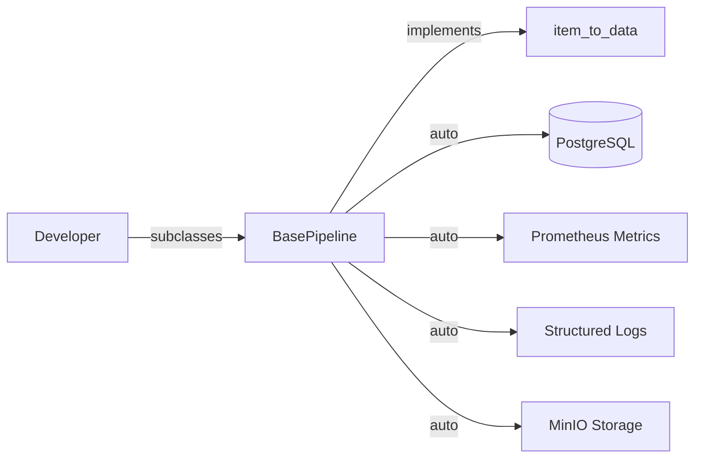

# Feature Specification: scrapper-base Core Package

> **Role of this Document:** Source of truth for the `scrapper-base` Python package — the foundational library all portal-specific scrapers depend on. Covers database connectivity, pipeline abstraction, metrics, and logging.

---

## 1. Overview

`scrapper-base` is a reusable Python package that provides the shared infrastructure for all portal-specific scrapers (Otodom, Nieruchomości Online, Gratka). It includes database models and services (PostgreSQL/PostGIS), an abstract `BasePipeline` class for Scrapy pipelines, Prometheus metrics auto-emission, structured logging, and a MinIO storage client.

---

## 2. Business Context

### 2.1 Problem Statement

- **Problem:** Each new portal scraper requires reimplementing the same boilerplate — DB connection, upsert logic, metrics, logging, error handling.
- **Affected Users:** Developer (solo)
- **Business Impact:** Without `scrapper-base`, adding a new portal would take 2-3 days instead of a few hours.

### 2.2 Goals & Success Metrics

- **Primary Goal:** A new scraper can be created by subclassing `BasePipeline` and implementing one method (`item_to_data()`)
- **KPIs:**
  - New scraper setup time: < 2 hours
  - Test coverage: ≥ 80%

---

## 3. User Experience & Functionality

### 3.1 Capabilities

- **Database connectivity:** Async PostgreSQL connection via SQLAlchemy 2.0 + asyncpg
- **Property upsert:** `upsert_property()` — insert new or update existing (matched by `portal_source` + `source_id`)
- **BasePipeline ABC:** Abstract base class with hooks for `process_item()`, `open_spider()`, `close_spider()`
- **Metrics auto-emission:** Prometheus counters, histograms, and gauges emitted automatically
- **Structured logging:** JSON-formatted logs with consistent fields (portal, scraper_id, run_id)
- **MinIO storage client:** Upload, download, deduplicate photos
- **Deduplication pipeline:** 4-stage dedup (blocking, heuristics, fuzzy match, image hash)

### 3.2 User Flows



### 3.3 Edge Cases & Error Handling

- **Concurrent writes:** Use `SELECT ... FOR UPDATE` or optimistic locking to prevent race conditions
- **DB connection failure:** Retry with exponential backoff (3 attempts), then fail with alert
- **Invalid data:** Validate against Pydantic models before DB write; log and skip invalid items
- **MinIO unavailable:** Log warning, continue without photo storage (graceful degradation)

---

## 4. Technical Architecture

### 4.1 Core Components

| Path | Component | Responsibility |
|------|-----------|---------------|
| `scraper_base/database.py` | Database connection | Async engine, session factory, connection pooling |
| `scraper_base/models.py` | SQLAlchemy models | Property, Agency, duplicate_groups, scraper_runs |
| `scraper_base/services.py` | Business logic | `upsert_property()`, `PropertyService` |
| `scraper_base/pipeline.py` | BasePipeline ABC | Scrapy pipeline base class |
| `scraper_base/metrics.py` | Prometheus metrics | Counter, histogram, gauge definitions |
| `scraper_base/logging_config.py` | Logging config | Structured JSON logging setup |
| `scraper_base/storage.py` | MinIO client | Photo upload/download/dedup |
| `scraper_base/deduplication/` | Dedup pipeline | 4-stage deduplication module |

### 4.2 API & Interface Contracts

**BasePipeline ABC:**

```python
class BasePipeline(ABC):
    PORTAL_SOURCE: str  # e.g., "otodom"

    @abstractmethod
    def item_to_data(self, item: ScrapyItem) -> dict:
        """Convert scraped item to property data dict."""
        ...

    async def open_spider(self, spider: Spider) -> None:
        """Initialize connections. Override for custom setup."""

    async def close_spider(self, spider: Spider) -> None:
        """Cleanup connections. Override for custom teardown."""

    async def process_item(self, item: ScrapyItem, spider: Spider) -> dict:
        """Process and persist item. Calls item_to_data() then upsert."""
        ...
```

**PropertyService:**

```python
class PropertyService:
    async def upsert_property(self, data: dict) -> Property:
        """Insert or update property. Returns (property, is_new)."""
        ...

    async def get_by_source(self, portal: str, source_id: str) -> Property | None:
        """Find property by portal source ID."""
        ...
```

### 4.3 Data Architecture

See `specs/070-DATABASE.md` for the full schema. Core tables:

- `properties` — LIST partitioned by `portal_source`
- `agencies` — Agency/property owner data
- `duplicate_groups` — Deduplication group assignments
- `scraper_runs` — Scraper execution history

---

## 5. Non-Functional Requirements

### 5.1 Performance & Scalability

- **Upsert throughput:** ≥ 100 properties/second (single scraper)
- **DB connection pool:** 5-10 connections per scraper instance
- **Metrics emission:** Zero-copy, non-blocking

### 5.2 Observability

- All operations emit structured logs with `portal`, `scraper_id`, `run_id`
- Prometheus metrics: `listings_scraped_total`, `scrape_errors_total`, `scrape_duration_seconds`, `db_write_duration_seconds`
- Metrics exposed via `/metrics` endpoint

---

## 6. Quality Assurance Strategy

### 6.1 Testing Approach

| Level | Location | Scope |
|-------|----------|-------|
| Unit | `tests/test_database.py` | DB models, session, connection |
| Unit | `tests/test_services.py` | upsert_property, edge cases |
| Unit | `tests/test_pipeline.py` | BasePipeline hooks |
| Unit | `tests/test_metrics.py` | Metric emission, labels |
| Unit | `tests/test_dedup*.py` | Dedup stages individually |

### 6.2 Key Test Scenarios

- New property inserted → verified by query
- Existing property upserted → `last_seen_at` updated
- Concurrent upserts → no duplicate records or race conditions
- Invalid data → skipped with logged error
- DB connection failure → retry then graceful failure

---

## 7. Dependencies & Risks

| Dependency | Risk | Mitigation |
|------------|------|------------|
| PostgreSQL 16 | Not available on target platform | Use Docker, pin version |
| Scrapy version | Breaking changes | Pin to compatible version |
| Playwright | Browser dependency | Containerized, regular updates |

---

## 8. Glossary

- **BasePipeline:** Abstract base class for Scrapy pipelines in `scrapper-base`
- **Upsert:** Insert or update — if a record exists by `(portal_source, source_id)`, update it; otherwise insert
- **Portal source:** Identifier string for each real estate portal (e.g., `"otodom"`, `"gratka"`)

## Document History

| Date | Author | Change |
|------|--------|--------|
| 2026-06-20 | rendenwald | Initial draft |
