```markdown
# 📋 Software Specification Document v2.1
## Real Estate Aggregation Platform — „Scalable from day one”

**Wersja:** 2.1 | **Data:** Czerwiec 2026 | **Status:** Gotowa do implementacji

---

## 1. 🎯 Wizja Platformy

```
┌─────────────────────────────────────────────────────────────────┐
│                    PLATFORMA NIERUCHOMOŚCI                      │
│                                                                 │
│  Scrapery → scrapper-base → PostgreSQL/PostGIS → FastAPI         │
│       ↓                                                         │
│  Deduplikacja → Redis Cache → SvelteKit Portal                  │
│       ↓                                                         │
│  Monitoring → Alerty → GitOps CI/CD → Self-hosted               │
└─────────────────────────────────────────────────────────────────┘
```

### Zasady Fundamentalne
- ✅ **100% Open Source** — zero kosztów licencji
- ✅ **Self-hosted** — własny serwer, pełna kontrola danych
- ✅ **GitOps** — infrastruktura jako kod, pełna historia zmian
- ✅ **Skalowalne** — od 1 serwera do klastra Kubernetes
- ✅ **Multi-język / Multi-waluta** — PL/EN/DE/UA + PLN/EUR/USD

---

## 2. 🏗️ Pełna Mapa Systemu

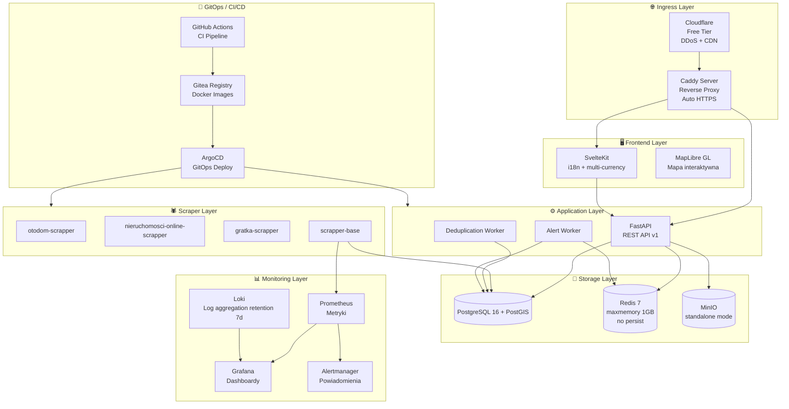

---

## 3. 📖 User Stories — Kompletny Backlog

### Epic 1: scrapper-base Core

| ID | User Story (EARS) | Points |
|----|-------------------|--------|
| SB-1 | **When** developer adds scraper, **shall** provide `BasePipeline` with DB, logging, metrics | 8 |
| SB-2 | **When** scrapers write simultaneously, **shall** handle concurrent writes safely | 5 |
| SB-3 | **When** property exists, **shall** update `last_seen_at` and changed fields | 3 |
| SB-4 | **When** scrapper-base updated, **shall** remain backwards compatible (semver) | 3 |
| SB-5 | **When** scraper runs, **shall** emit Prometheus metrics automatically | 5 |
| SB-6 | **When** scraper errors occur, **shall** send alert via Alertmanager | 5 |

### Epic 2: Metryki Scraperów

| ID | User Story (EARS) | Points |
|----|-------------------|--------|
| MT-1 | **When** scraper runs, **shall** track `listings_scraped_total` counter per portal | 3 |
| MT-2 | **When** scraper errors, **shall** increment `scrape_errors_total` with error_type label | 3 |
| MT-3 | **When** scraper finishes, **shall** record `scrape_duration_seconds` histogram | 3 |
| MT-4 | **When** DB write occurs, **shall** track `db_write_duration_seconds` | 3 |
| MT-5 | **When** Grafana opens, **shall** show per-portal dashboard with all metrics | 5 |
| MT-6 | **When** error_rate > 5%, **shall** trigger Alertmanager notification | 5 |

### Epic 3: Mapa Interaktywna

| ID | User Story (EARS) | Points |
|----|-------------------|--------|
| MAP-1 | **When** user opens map view, **shall** display property clusters with counts | 8 |
| MAP-2 | **When** user zooms in, **shall** expand clusters into individual markers | 5 |
| MAP-3 | **When** user clicks marker, **shall** show property card popup | 3 |
| MAP-4 | **When** user draws area on map, **shall** filter results to that polygon | 8 |
| MAP-5 | **When** filters change, **shall** update map markers without page reload | 5 |

### Epic 4: GitOps + CI/CD

| ID | User Story (EARS) | Points |
|----|-------------------|--------|
| CI-1 | **When** code pushed to main, **shall** run tests, lint, build Docker image | 5 |
| CI-2 | **When** image built, **shall** push to self-hosted Gitea registry | 3 |
| CI-3 | **When** image pushed, **shall** ArgoCD auto-sync deployment | 5 |
| CI-4 | **When** deployment fails, **shall** auto-rollback to previous version | 5 |
| CI-5 | **When** PR opened, **shall** run full test suite and preview deploy | 8 |

### Epic 5: Redis Cache

| ID | User Story (EARS) | Points |
|----|-------------------|--------|
| RC-1 | **When** `/api/v1/properties` called, **shall** serve from Redis cache (TTL 2min) | 5 |
| RC-2 | **When** new property scraped, **shall** invalidate relevant cache keys | 3 |
| RC-3 | **When** `/api/v1/cities` called, **shall** cache response for 1 hour | 3 |
| RC-4 | **When** user alert triggered, **shall** use Redis Streams for real-time delivery | 8 |
| RC-5 | **When** Redis unavailable, **shall** fallback to direct DB query gracefully | 5 |

### Epic 6: Przechowywanie Zdjęć

| ID | User Story (EARS) | Points |
|----|-------------------|--------|
| IMG-1 | **When** scraper downloads photo, **shall** store in MinIO with deduplication | 5 |
| IMG-2 | **When** photo requested, **shall** serve via CDN-friendly URL with cache headers | 3 |
| IMG-3 | **When** user uploads property photo, **shall** validate, resize and store in MinIO | 8 |
| IMG-4 | **When** photo stored, **shall** generate thumbnail (400x300) automatically | 5 |
| IMG-5 | **When** property deleted, **shall** cleanup orphaned photos from MinIO | 3 |

### Epic 7: Wielojęzyczność + Wielowalutowość

| ID | User Story (EARS) | Points |
|----|-------------------|--------|
| I18N-1 | **When** user selects language, **shall** display all UI in PL/EN/DE/UA | 8 |
| I18N-2 | **When** user selects currency, **shall** convert prices using daily ECB rates | 8 |
| I18N-3 | **When** URL accessed with `/en/`, **shall** serve English version with hreflang | 5 |
| I18N-4 | **When** price displayed, **shall** format according to locale (1 250 000 zł vs €312,500) | 3 |
| I18N-5 | **When** search performed, **shall** normalize Polish diacritics in city names | 3 |

### Epic 8: Skalowanie

| ID | User Story (EARS) | Points |
|----|-------------------|--------|
| SC-1 | **When** traffic spikes, **shall** scale FastAPI horizontally with multiple replicas | 8 |
| SC-2 | **When** DB queries slow, **shall** use read replicas for SELECT operations | 8 |
| SC-3 | **When** scraper count grows, **shall** schedule via Kubernetes CronJob independently | 5 |
| SC-4 | **When** storage grows, **shall** MinIO expand across multiple disks/nodes | 5 |

### Epic 9: Alerty + Notyfikacje

| ID | User Story (EARS) | Points |
|----|-------------------|--------|
| ALT-1 | **When** user creates alert (city + price + type), **shall** save search criteria | 5 |
| ALT-2 | **When** new matching property scraped, **shall** notify user via email | 8 |
| ALT-3 | **When** user enables push, **shall** send browser push notification | 8 |
| ALT-4 | **When** scraper error_rate > 5%, **shall** notify admin via email + Slack | 5 |
| ALT-5 | **When** DB disk > 80%, **shall** trigger critical alert to admin | 5 |

### Epic 10: Monitoring

| ID | User Story (EARS) | Points |
|----|-------------------|--------|
| MON-1 | **When** Grafana opened, **shall** show unified dashboard: scrapers + DB + API + frontend | 8 |
| MON-2 | **When** API p95 latency > 500ms, **shall** alert admin | 5 |
| MON-3 | **When** PostgreSQL connections > 80%, **shall** alert admin | 5 |
| MON-4 | **When** Redis memory > 90%, **shall** alert admin | 3 |
| MON-5 | **When** any container crashes, **shall** alert within 1 minute | 5 |
| MON-6 | **When** SvelteKit Core Web Vitals degrade, **shall** alert admin | 5 |

---

## 4. ✅ Acceptance Criteria — Kluczowe Scenariusze

### MT-5: Dashboard Grafana — Metryki Scraperów

```gherkin
Given scraper uruchomiony dla portalu "otodom"
And scraper zakończył sesję scrapowania

When admin otwiera Grafana dashboard "Scrapers Overview"

Then widzi wykres listings_scraped_total z podziałem per portal
And widzi histogram scrape_duration_seconds (p50, p95, p99)
And widzi alert jeśli error_rate > 5% przez ostatnie 15 minut
And dane są odświeżane co 30 sekund
```

### MAP-4: Filtrowanie geograficzne na mapie

```gherkin
Given użytkownik jest na stronie /mapa
And mapa pokazuje 500 ofert w Polsce

When użytkownik rysuje polygon na mapie obejmujący dzielnicę Krzyki we Wrocławiu

Then lista ofert po prawej aktualizuje się do ofert w narysowanym obszarze
And URL aktualizuje się do /oferty?bbox=17.01,51.08,17.07,51.12
And licznik pokazuje "Znaleziono X ofert w wybranym obszarze"
And mapa pokazuje tylko markery w narysowanym obszarze
```

### I18N-2: Konwersja walut

```gherkin
Given oferta ma cenę 620 000 PLN
And użytkownik wybrał walutę EUR
And dzisiejszy kurs ECB: 1 EUR = 4.25 PLN

When karta oferty jest wyświetlona

Then cena wyświetla się jako "145 882 €"
And format liczby jest zgodny z locale (145 882 € dla PL, €145,882 dla EN)
And tooltip pokazuje "Przeliczone wg kursu ECB z dnia 2026-06-15"
And cena w PLN jest dostępna po najechaniu na wartość
```

### ALT-2: Alert email o nowej ofercie

```gherkin
Given użytkownik "jan@example.com" ma aktywny alert:
  city="Wrocław", property_type="flat",
  price_max=600000, area_min=50

When scraper zapisuje nową ofertę spełniającą kryteria

Then system wysyła email do jan@example.com w ciągu 5 minut
And email zawiera: zdjęcie, cenę, metraż, link do oferty
And email jest wysłany w języku wybranym przez użytkownika
And użytkownik może wypisać się linkiem w stopce emaila
```

---

## 5. 🗺️ User Journey Maps

### Journey 1: Developer — Dodanie Nowego Scrapera (GitOps Flow)

```
START: Developer chce dodać scraper dla Gratki
  │
  ▼
[1. Setup lokalne]
git clone gratka-scrapper
pip install scrapper-base==1.x.x
  │ ✅ 5 minut
  ▼
[2. Implementacja]
class GratkaPipeline(BasePipeline):
    PORTAL_SOURCE = "gratka"
    def item_to_data(self, item): ...
  │ ✅ 2-4 godziny (tylko logika portalu)
  ▼
[3. Testy lokalne]
pytest tests/ -v
scrapy crawl search --dry-run
  │ ✅ Metryki widoczne w localhost:9090
  ▼
[4. Pull Request]
git push origin feature/gratka-spider
  │ ✅ GitHub Actions: lint → test → build image
  ▼
[5. Merge do main]
CI buduje Docker image → pushuje do Gitea Registry
  │ ✅ Image: gitea.local/scrapers/gratka:v1.0.0
  ▼
[6. ArgoCD auto-deploy]
ArgoCD wykrywa nowy image → deploy CronJob do k8s
  │ ✅ Scraper działa o 02:00 każdej nocy
  ▼
[7. Monitoring]
Grafana pokazuje nowy panel "gratka" automatycznie
  │ ✅ Alert jeśli error_rate > 5%
  ▼
END: Nowy portal live w produkcji
⏱️ Czas: 1 dzień roboczy
```

### Journey 2: Użytkownik — Szukanie z Alertem

```
START: Anna szuka mieszkania we Wrocławiu
  │
  ▼
[1. Landing Page - PL]
Widzi hero: "Znajdź wymarzone mieszkanie"
Wyszukiwarka: Wrocław | Mieszkanie | 400k-600k | 50m²+
  │ 💭 "Ładna strona, profesjonalna"
  ▼
[2. Wyniki z mapą]
Lista 234 ofert + mapa z klastrami
Bez duplikatów — każda nieruchomość raz
  │ 💭 "Super, żadnych powtórzeń!"
  ▼
[3. Filtrowanie na mapie]
Rysuje obszar: tylko Krzyki i Południe
Wyniki: 47 ofert
  │ 💭 "Dokładnie te dzielnice chcę"
  ▼
[4. Karta oferty]
Widzi: zdjęcie, 520 000 zł, 62m², 3 pokoje
Ikonki: [Otodom] [Gratka] — ta sama oferta na 2 portalach
  │ 💭 "Wiem że to jeden lokal, nie duplikat"
  ▼
[5. Szczegóły oferty]
Galeria 12 zdjęć, pełny opis, mapa lokalizacji
Sekcja: "Dostępne na portalach:" [Otodom↗] [Gratka↗]
  │ 💭 "Mogę porównać komentarze na obu"
  ▼
[6. Tworzenie alertu]
Klika "Ustaw alert" → email gdy pojawi się tańsza
Konfiguruje: max 500k, min 55m², Krzyki
  │ ✅ "Alert ustawiony — dostaniesz email"
  ▼
[7. Email po 3 dniach]
"Anna, nowa oferta spełnia Twoje kryteria:
 Mieszkanie 58m², 485 000 zł, ul. Grunwaldzka [SPRAWDŹ]"
  │ 💭 "Idealnie! Dokładnie to czego szukałam"
  ▼
END: Anna umawia oglądanie mieszkania
```

### Journey 3: Admin — Monitoring i Alerty

```
START: Poniedziałek 08:00, admin sprawdza platformę
  │
  ▼
[1. Grafana Dashboard]
Otwiera "Platform Overview":
✅ Scrapery: 3/3 działają
✅ API: p95 = 180ms
✅ DB: 23% pojemności
✅ Redis: 45% pamięci
  │ 💭 "Wszystko green"
  ▼
[2. Alert o 14:00]
Email: "⚠️ Otodom scraper error_rate = 8% (próg: 5%)"
Slack: "#alerts: otodom-scrapper failing"
  │ 😟 "Coś się zepsuło"
  ▼
[3. Diagnoza]
Grafana Loki: logi z ostatniej godziny
Error: "CSS selector .listing-item not found"
  │ 💭 "Otodom zmienił HTML"
  ▼
[4. Naprawa]
git commit -m "fix: update listing selector"
Push → CI → ArgoCD deploy w 3 minuty
  │ ✅ Automatyczny rollout bez downtime
  ▼
[5. Weryfikacja]
Grafana: error_rate spada do 0%
Alertmanager: "✅ RESOLVED: otodom error_rate"
  │ ✅ Problem rozwiązany w 15 minut
  ▼
END: Platform healthy
```

---

## 6. 🏗️ Architektura Szczegółowa

### 6.1 Stack Technologiczny — Self-Hosted, 100% Open Source

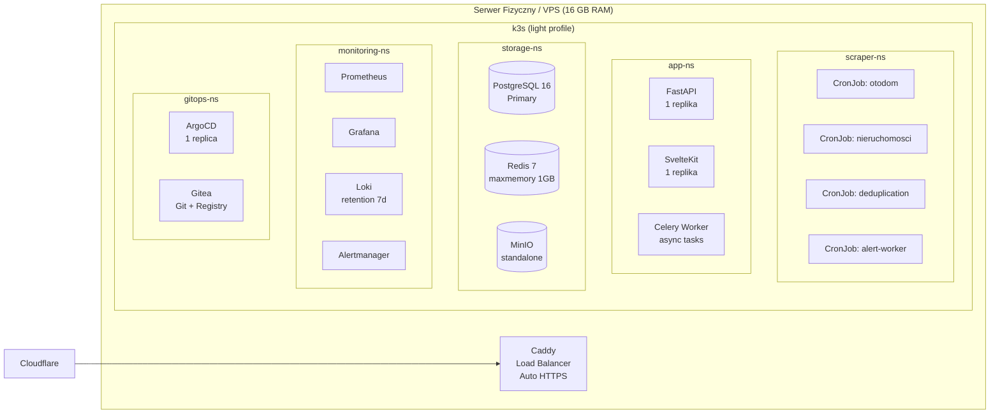

**Instalacja k3s:**

```bash
curl -sfL https://get.k3s.io | sh -s - \
  --disable=traefik \
  --disable=servicelb \
  --disable=local-storage \
  --disable=metrics-server \
  --flannel-backend=none \
  --write-kubeconfig-mode=644
```

### 6.2 Wymagania Sprzętowe (Self-Hosted)

| Komponent | Minimalne | Zalecane | Uzasadnienie |
|-----------|-----------|----------|--------------|
| CPU | 4 rdzenie | 8 rdzeni | Playwright + k8s overhead |
| RAM | 16 GB | 32 GB | PostgreSQL + Redis + monitoring |
| Dysk OS | 50 GB SSD | 100 GB NVMe | System + Docker images |
| Dysk Dane | 200 GB | 1 TB | PostgreSQL + MinIO zdjęcia |
| Sieć | 100 Mbps | 1 Gbps | Scraping + CDN |

### 6.3 Metryki Scraperów — Prometheus

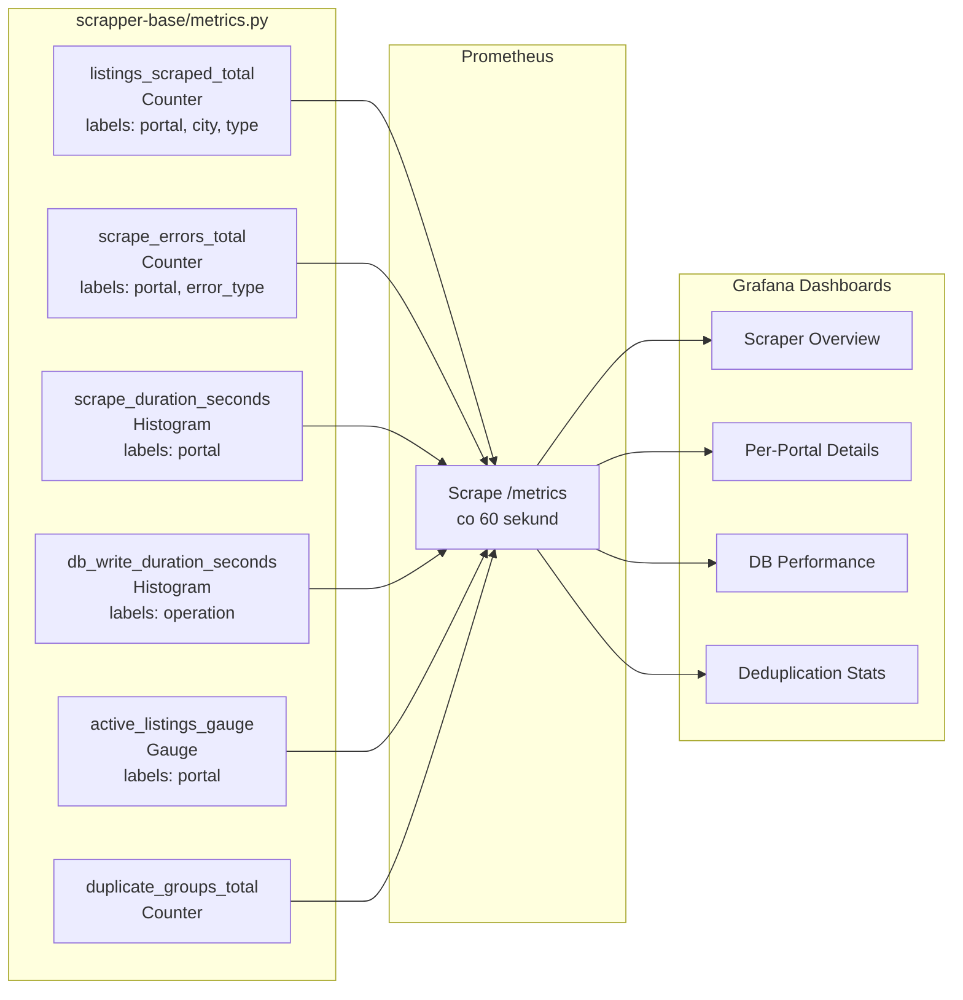

### 6.4 Redis — Architektura Cache + Streams

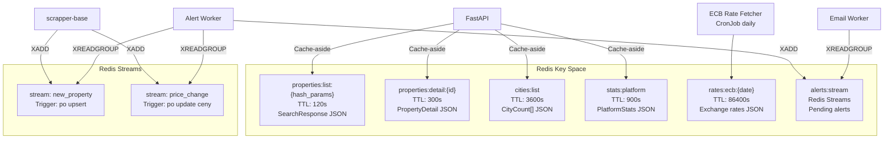

**Konfiguracja Redis (ConfigMap):**

```yaml
apiVersion: v1
kind: ConfigMap
metadata:
  name: redis-config
data:
  redis.conf: |
    maxmemory 1gb
    maxmemory-policy allkeys-lru
    save ""
    appendonly no
```

### 6.5 MinIO — Architektura Zdjęć (standalone)

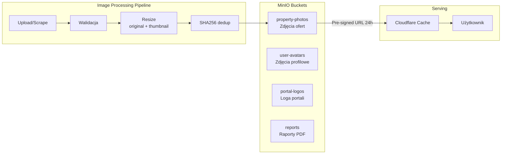

**Deployment MinIO (standalone):**

```yaml
apiVersion: apps/v1
kind: StatefulSet
metadata:
  name: minio
spec:
  replicas: 1
  template:
    spec:
      containers:
      - name: minio
        image: minio/minio:latest
        args: ["server", "/data"]
        env:
        - name: MINIO_ROOT_USER
          value: "minioadmin"
        - name: MINIO_ROOT_PASSWORD
          value: "minioadmin123"
        volumeMounts:
        - name: data
          mountPath: /data
  volumeClaimTemplates:
  - metadata:
      name: data
    spec:
      accessModes: ["ReadWriteOnce"]
      resources:
        requests:
          storage: 200Gi
```

---

## 7. 🌍 Wielojęzyczność + Wielowalutowość

### 7.1 Architektura i18n w SvelteKit

```mermaid
graph TB
    subgraph "URL Structure"
        PL["/pl/oferty - Polski domyślny"]
        EN["/en/properties - English"]
        DE["/de/immobilien - Deutsch"]
        UA["/ua/neruhomist - Українська"]
    end

    subgraph "i18n Stack"
        LIB[paraglide-js]
        MSGS[messages/<br/>pl.json<br/>en.json<br/>de.json<br/>ua.json]
        LIB --> MSGS
    end

    subgraph "Currency Service"
        ECB[ECB API<br/>Daily rates fetch]
        STORE[Redis Cache<br/>rates:ecb:YYYY-MM-DD]
        CONV[formatCurrency()<br/>Intl.NumberFormat]
        ECB --> STORE --> CONV
    end

    subgraph "SEO"
        HREFLANG[hreflang tags<br/>pl/en/de/ua]
        SITEMAP[sitemap.xml<br/>per language]
        OG[OpenGraph<br/>locale-specific]
    end
```

### 7.2 Obsługiwane Języki i Waluty

| Język | Kod | Waluta | Format Ceny | URL Prefix |
|-------|-----|--------|-------------|------------|
| Polski | `pl` | PLN | `1 250 000 zł` | `/pl/` (domyślny) |
| English | `en` | EUR/GBP/USD | `€312,500` | `/en/` |
| Deutsch | `de` | EUR | `312.500 €` | `/de/` |
| Українська | `ua` | UAH/PLN | `₴12 500 000` | `/ua/` |

### 7.3 Struktura Pliku Tłumaczeń

```json
{
  "nav.offers": "Oferty",
  "nav.map": "Mapa",
  "nav.add": "Dodaj ogłoszenie",
  "search.location.placeholder": "np. Warszawa, Mokotów",
  "search.type.all": "Wszystkie typy",
  "property.price": "{price} {currency}",
  "property.area": "{area} m²",
  "property.rooms": "{count, plural, one {# pokój} few {# pokoje} many {# pokoi} other {# pokoi}}",
  "property.available_on": "Dostępne na {count, plural, one {# portalu} other {# portalach}}",
  "alert.created": "Alert utworzony! Powiadomimy Cię gdy pojawi się nowa oferta.",
  "currency.disclaimer": "Przeliczone wg kursu ECB z dnia {date}",
  "map.cluster": "{count} ofert",
  "portal.otodom": "Otodom",
  "portal.gratka": "Gratka",
  "portal.nieruchomosci-online": "Nieruchomości Online"
}
```

---

## 8. 🗄️ Schemat Bazy Danych — Kompletny

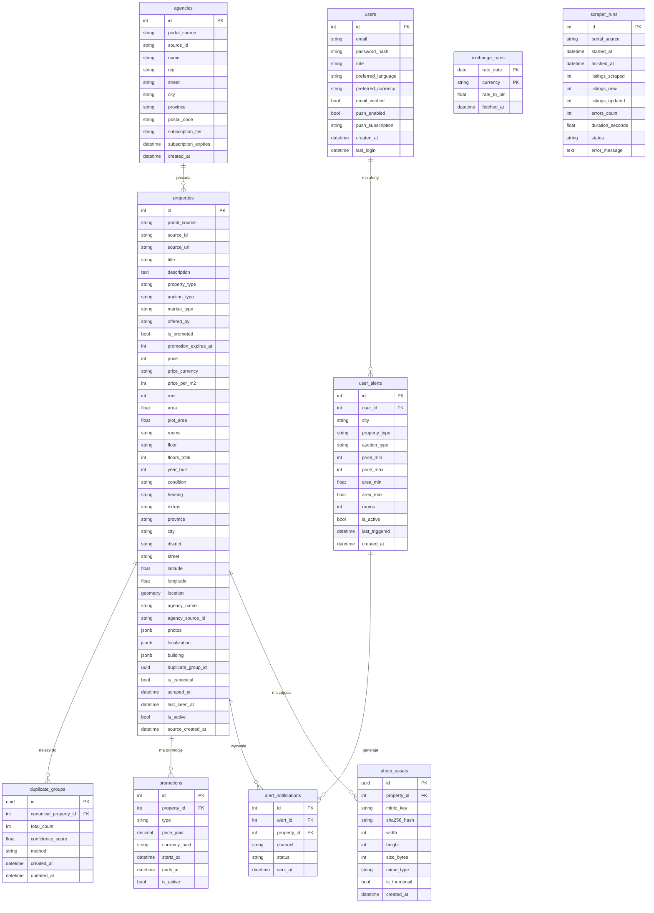

**Partycjonowanie (przy tworzeniu tabeli):**

```sql
CREATE TABLE properties (
    id SERIAL,
    portal_source VARCHAR(50),
    -- ... pozostałe kolumny ...
    PRIMARY KEY (id, portal_source)
) PARTITION BY LIST (portal_source);

CREATE TABLE properties_otodom PARTITION OF properties FOR VALUES IN ('otodom');
CREATE TABLE properties_gratka PARTITION OF properties FOR VALUES IN ('gratka');
CREATE TABLE properties_nieruchomosci_online PARTITION OF properties FOR VALUES IN ('nieruchomosci-online');
CREATE TABLE properties_other PARTITION OF properties DEFAULT;
```

---

## 9. 🔄 GitOps + CI/CD Pipeline

### 9.1 Workflow Diagram

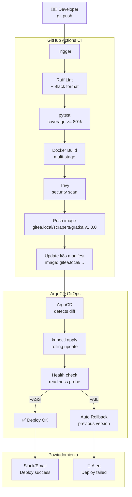

### 9.2 Struktura Manifestów Kubernetes

```
k8s/
├── namespaces/
│   ├── scrapers.yaml
│   ├── app.yaml
│   ├── storage.yaml
│   └── monitoring.yaml
├── scrapers/
│   ├── otodom-cronjob.yaml        # schedule: "0 2 * * *"
│   ├── nieruchomosci-cronjob.yaml # schedule: "30 2 * * *"
│   └── deduplication-cronjob.yaml # schedule: "0 6 * * *"
├── app/
│   ├── fastapi-deployment.yaml    # 1 replika
│   ├── sveltekit-deployment.yaml  # 1 replika
│   ├── alert-worker-deployment.yaml
│   └── services.yaml
├── storage/
│   ├── postgres-statefulset.yaml
│   ├── redis-statefulset.yaml
│   └── minio-statefulset.yaml
├── monitoring/
│   ├── prometheus-config.yaml
│   ├── grafana-deployment.yaml
│   ├── loki-config.yaml
│   └── alertmanager-config.yaml
└── argocd/
    ├── app-of-apps.yaml
    └── applications/
        ├── scrapers-app.yaml
        ├── backend-app.yaml
        └── monitoring-app.yaml
```

### 9.3 GitHub Actions Workflow

```yaml
# .github/workflows/ci.yml
name: CI/CD Pipeline

on:
  push:
    branches: [main]
  pull_request:
    branches: [main]

jobs:
  test:
    runs-on: ubuntu-latest
    steps:
      - uses: actions/checkout@v4
      - name: Lint (Ruff + Black)
        run: ruff check . && black --check .
      - name: Test (pytest)
        run: pytest --cov=. --cov-fail-under=80
      - name: Type check (mypy)
        run: mypy scraper_base/

  build-and-push:
    needs: test
    if: github.ref == 'refs/heads/main'
    steps:
      - name: Build Docker image
        run: docker build -t gitea.local/${{ github.repository }}:${{ github.sha }} .
      - name: Trivy security scan
        uses: aquasecurity/trivy-action@master
        with:
          exit-code: '1'
          severity: 'CRITICAL'
      - name: Push to Gitea Registry
        run: docker push gitea.local/${{ github.repository }}:${{ github.sha }}
      - name: Update k8s manifests
        run: |
          sed -i "s|image:.*|image: gitea.local/${{ github.repository }}:${{ github.sha }}|" \
            k8s/app/fastapi-deployment.yaml
          git commit -am "ci: update image to ${{ github.sha }}"
          git push
```

### 9.4 Minimalna instalacja ArgoCD

```bash
kubectl create ns argocd
kubectl apply -n argocd -f https://raw.githubusercontent.com/argoproj/argo-cd/stable/manifests/install.yaml
kubectl patch deployment argocd-server -n argocd -p '{"spec":{"replicas":1}}'
kubectl patch deployment argocd-redis -n argocd -p '{"spec":{"replicas":0}}'
kubectl delete deployment argocd-dex-server -n argocd
```

---

## 10. 📊 Monitoring — Kompletny Stack

### 10.1 Grafana Dashboards

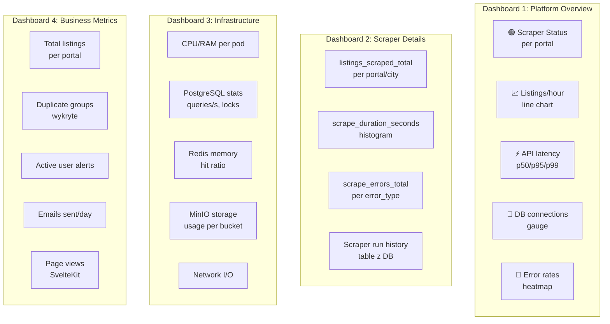

### 10.2 Alertmanager — Reguły Alertów

```yaml
# alertmanager-rules.yaml
groups:
  - name: scrapers
    rules:
      - alert: ScraperHighErrorRate
        expr: |
          rate(scrape_errors_total[15m]) /
          rate(listings_scraped_total[15m]) > 0.05
        for: 15m
        labels:
          severity: warning
        annotations:
          summary: "Scraper {{ $labels.portal }} error rate > 5%"
          description: "Error rate: {{ $value | humanizePercentage }}"

      - alert: ScraperNotRunning
        expr: |
          time() - scraper_last_run_timestamp > 86400
        labels:
          severity: critical
        annotations:
          summary: "Scraper {{ $labels.portal }} nie uruchamiał się > 24h"

  - name: infrastructure
    rules:
      - alert: PostgreSQLHighConnections
        expr: pg_stat_activity_count > 80
        labels:
          severity: warning

      - alert: DiskSpaceCritical
        expr: |
          (node_filesystem_avail_bytes / node_filesystem_size_bytes) < 0.20
        labels:
          severity: critical

      - alert: RedisMemoryHigh
        expr: redis_memory_used_bytes / redis_memory_max_bytes > 0.90
        labels:
          severity: warning

      - alert: APIHighLatency
        expr: |
          histogram_quantile(0.95,
            rate(http_request_duration_seconds_bucket[5m])
          ) > 0.5
        labels:
          severity: warning

      - alert: ContainerCrashLooping
        expr: rate(kube_pod_container_status_restarts_total[15m]) > 0
        labels:
          severity: critical
```

### 10.3 Kanały Powiadomień

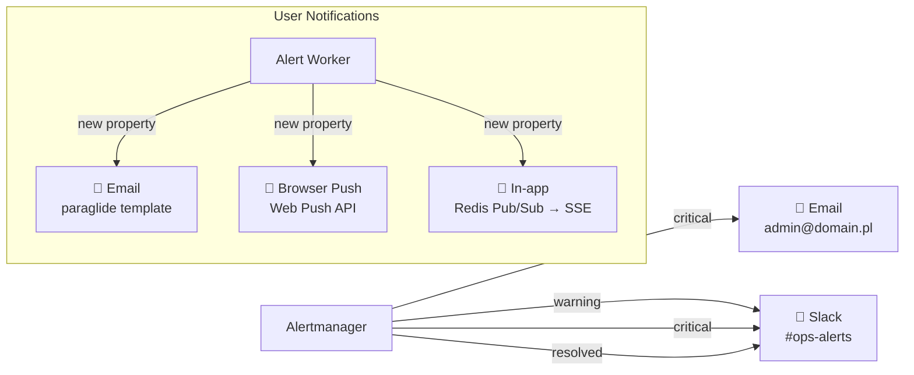

### 10.4 Konfiguracja Loki (retention 7 dni)

```yaml
limits_config:
  max_lookback_period: 168h
  retention_period: 168h
```

---

## 11. 📈 Strategie Skalowania

### 11.1 Fazy Skalowania

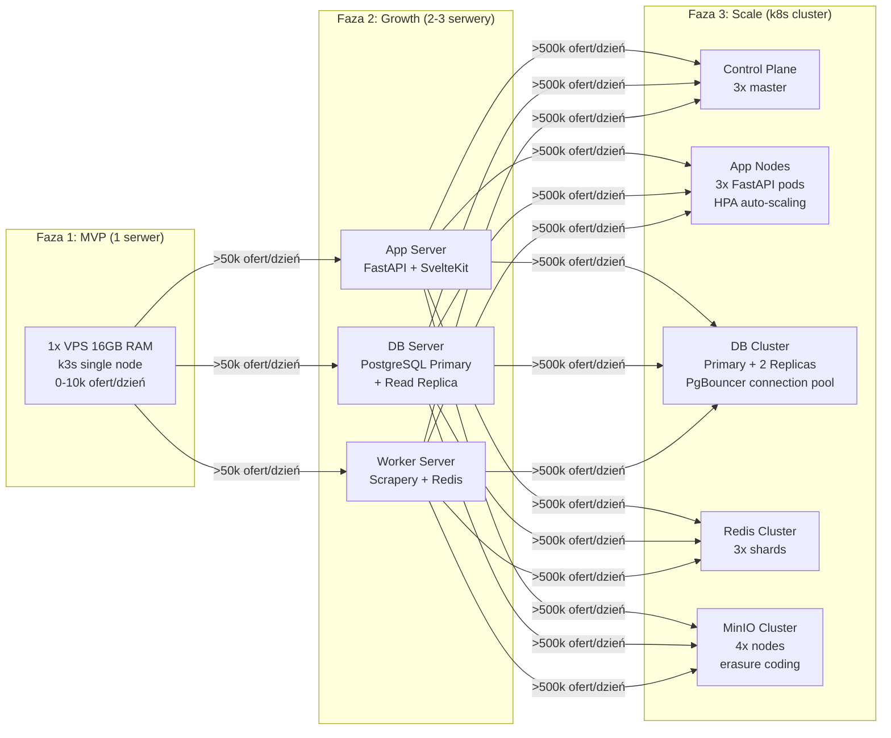

### 11.2 Strategie per Komponent

| Komponent | Faza 1 | Faza 2 | Faza 3 |
|-----------|--------|--------|--------|
| **FastAPI** | 1 instancja | 2 instancje | HPA: 2-10 podów |
| **PostgreSQL** | 1 node | Primary + Read Replica | Primary + 2 Replicas + PgBouncer |
| **Redis** | 1 node, maxmemory 1GB | Sentinel (HA) | Redis Cluster (3 shards) |
| **MinIO** | 1 node (standalone) | 2 nodes erasure | 4+ nodes distributed |
| **Scrapery** | k8s CronJob | k8s CronJob | k8s CronJob + parallelism |
| **SvelteKit** | 1 instancja | 2 instancje | CDN pre-rendering |
| **Monitoring** | 1 node, scrape 60s | 1 node | Thanos (long-term storage) |

### 11.3 Optymalizacje Bazy Danych

```sql
-- Indeksy dla najczęstszych zapytań
CREATE INDEX CONCURRENTLY idx_properties_search
ON properties (city, property_type, auction_type, price)
WHERE is_canonical = true AND is_active = true;

-- Indeks geoprzestrzenny PostGIS
CREATE INDEX CONCURRENTLY idx_properties_location
ON properties USING GIST (location)
WHERE is_canonical = true;

-- Widok dla portalu (bez duplikatów)
CREATE MATERIALIZED VIEW canonical_properties AS
SELECT DISTINCT ON (duplicate_group_id) *
FROM properties
WHERE is_canonical = true
  AND is_active = true
ORDER BY duplicate_group_id, is_promoted DESC, scraped_at DESC;

-- Odświeżanie widoku (po każdym scraping run)
REFRESH MATERIALIZED VIEW CONCURRENTLY canonical_properties;
```

---

## 12. 🔌 TypeScript Interfaces — Kompletne

```typescript
// lib/types/index.ts — Kompletne typy dla SvelteKit

export type PortalSource =
  | 'otodom' | 'nieruchomosci-online' | 'gratka'
  | 'morizon' | 'domiporta' | 'olx' | 'gumtree';

export type PropertyType =
  | 'flat' | 'house' | 'plot' | 'venue'
  | 'garage' | 'magazine' | 'investment' | 'room';

export type AuctionType = 'sale' | 'rent';
export type Language = 'pl' | 'en' | 'de' | 'ua';
export type Currency = 'PLN' | 'EUR' | 'USD' | 'GBP' | 'UAH';

// ── Ikonki portali ──────────────────────────────────────────────
export interface PortalLink {
  portal: PortalSource;
  url: string;
  logoUrl: string;
  label: string;  // "Otodom", "Gratka" etc.
}

// ── Karta oferty (lista wyników) ────────────────────────────────
export interface PropertyCard {
  id: number;
  title: string;
  propertyType: PropertyType;
  auctionType: AuctionType;
  price: number;
  priceCurrency: Currency;
  priceConverted?: number;    // przeliczona cena
  priceDisplayCurrency?: Currency;
  pricePerM2?: number;
  area?: number;
  plotArea?: number;
  rooms?: string;
  city: string;
  district?: string;
  latitude?: number;
  longitude?: number;
  thumbnail?: string;
  isPromoted: boolean;
  isNew: boolean;             // scraped_at < 24h temu
  portalLinks: PortalLink[];  // ikonki portali
  totalPortals: number;       // liczba portali
  scrapedAt: string;
  duplicateGroupId?: string;
}

// ── Pełna strona szczegółów ─────────────────────────────────────
export interface PropertyDetail extends PropertyCard {
  description?: string;
  photos: string[];
  floor?: string;
  floorsTotal?: number;
  yearBuilt?: number;
  constructionStatus?: string;
  condition?: string;
  heating?: string;
  extras?: string[];
  securityTypes?: string[];
  parking?: string;
  marketType?: string;
  offeredBy?: 'private' | 'agency';
  agencyName?: string;
  building?: {
    type?: string;
    floors?: number;
    buildYear?: number;
  };
}

// ── Mapa ────────────────────────────────────────────────────────
export interface MapMarker {
  id: number;
  lat: number;
  lng: number;
  price: number;
  currency: Currency;
  propertyType: PropertyType;
  isPromoted: boolean;
  thumbnail?: string;
}

export interface MapCluster {
  lat: number;
  lng: number;
  count: number;
  avgPrice: number;
}

export interface BoundingBox {
  minLat: number;
  minLng: number;
  maxLat: number;
  maxLng: number;
}

// ── Wyszukiwanie ─────────────────────────────────────────────────
export interface SearchParams {
  city?: string;
  propertyType?: PropertyType | 'all';
  auctionType?: AuctionType | 'all';
  priceMin?: number;
  priceMax?: number;
  areaMin?: number;
  areaMax?: number;
  rooms?: number | 'any';
  marketType?: 'primary' | 'secondary' | 'all';
  bbox?: BoundingBox;
  page?: number;
  limit?: number;
  sortBy?: SortOption;
  lang?: Language;
  currency?: Currency;
}

export type SortOption =
  | 'price_asc' | 'price_desc'
  | 'date_desc' | 'area_desc'
  | 'promoted_first';

// ── Alerty użytkownika ───────────────────────────────────────────
export interface UserAlert {
  id: number;
  city?: string;
  propertyType?: PropertyType;
  auctionType?: AuctionType;
  priceMin?: number;
  priceMax?: number;
  areaMin?: number;
  areaMax?: number;
  rooms?: number;
  isActive: boolean;
  createdAt: string;
  lastTriggered?: string;
}

export interface CreateAlertRequest {
  city?: string;
  propertyType?: PropertyType;
  priceMin?: number;
  priceMax?: number;
  areaMin?: number;
}

// ── Waluty ───────────────────────────────────────────────────────
export interface ExchangeRates {
  base: 'PLN';
  date: string;
  rates: Record<Currency, number>;
}

// ── API Responses ─────────────────────────────────────────────────
export interface PaginatedResponse<T> {
  data: T[];
  meta: {
    total: number;
    page: number;
    limit: number;
    pages: number;
  };
}

export type SearchResponse = PaginatedResponse<PropertyCard>;

export interface ApiError {
  type: string;
  title: string;
  status: number;
  detail: string;
  instance: string;
}
```

---

## 13. 🔌 API Endpoints — Kompletna Lista

### FastAPI Endpoints

| Method | Endpoint | Cache | Opis |
|--------|----------|-------|------|
| `GET` | `/api/v1/properties` | 2 min | Lista z filtrami, paginacja |
| `GET` | `/api/v1/properties/{id}` | 5 min | Szczegóły oferty |
| `GET` | `/api/v1/properties/{id}/portals` | 5 min | Lista portali dla oferty |
| `GET` | `/api/v1/properties/map` | 1 min | Markery i klastry dla mapy |
| `GET` | `/api/v1/cities` | 1h | Miasta z liczbą ofert |
| `GET` | `/api/v1/stats` | 15 min | Statystyki platformy |
| `GET` | `/api/v1/exchange-rates` | 24h | Kursy walut ECB |
| `POST` | `/api/v1/alerts` | — | Utwórz alert (auth) |
| `GET` | `/api/v1/alerts` | — | Lista alertów użytkownika (auth) |
| `DELETE` | `/api/v1/alerts/{id}` | — | Usuń alert (auth) |
| `POST` | `/api/v1/auth/register` | — | Rejestracja |
| `POST` | `/api/v1/auth/login` | — | Logowanie → JWT |
| `GET` | `/api/v1/admin/scrapers` | — | Status scraperów (admin) |
| `POST` | `/api/v1/admin/dedup/run` | — | Uruchom deduplikację (admin) |
| `GET` | `/metrics` | — | Prometheus metrics endpoint |

---

## 14. 📦 Kompletna Struktura Repozytoriów

```
# Repozytoria (osobne Git repos)

scrapper-base/                     ← pip package (PyPI prywatny / Gitea)
├── scraper_base/
│   ├── __init__.py
│   ├── database.py               ← PostgreSQL + PostGIS connection
│   ├── models.py                 ← Property, Agency SQLAlchemy models
│   ├── services.py               ← upsert_property(), PropertyService
│   ├── pipeline.py               ← BasePipeline ABC
│   ├── metrics.py                ← Prometheus metrics (listings_scraped_total...)
│   ├── logging_config.py         ← Structured JSON logging
│   ├── storage.py                ← MinIO client (photo upload/download)
│   └── deduplication/
│       ├── __init__.py
│       ├── pipeline.py           ← run_deduplication(df_a, df_b)
│       ├── blocking.py           ← Etap 1: grupowanie
│       ├── heuristics.py         ← Etap 2: progi cenowe/metraż
│       ├── fuzzy_matching.py     ← Etap 3: RapidFuzz scoring
│       └── image_hashing.py      ← Etap 4: phash (opcjonalny)
├── tests/
├── pyproject.toml                ← scrapper-base==1.x.x
└── CHANGELOG.md

otodom-scrapper/                  ← pip install scrapper-base>=1.0.0
├── otodomscraper/
│   ├── spiders/search_spider.py
│   ├── pipelines.py              ← class OtodomPipeline(BasePipeline)
│   ├── items.py
│   └── stealth_utils.py
├── Dockerfile
├── k8s/cronjob.yaml
└── settings.json

nieruchomosci-online-scrapper/    ← pip install scrapper-base>=1.0.0
├── nieruchomosciscraper/
│   ├── spiders/search_spider.py
│   ├── parser.py
│   ├── pipelines.py              ← class NieruchomosciPipeline(BasePipeline)
│   ├── urls.py
│   └── stealth_utils.py
├── Dockerfile
├── k8s/cronjob.yaml
└── settings.json

real-estate-portal/               ← SvelteKit frontend
├── src/
│   ├── lib/
│   │   ├── i18n/                 ← paraglide-js
│   │   │   ├── messages/
│   │   │   │   ├── pl.json
│   │   │   │   ├── en.json
│   │   │   │   ├── de.json
│   │   │   │   └── ua.json
│   │   │   └── runtime.js
│   │   ├── api/                  ← API client
│   │   ├── stores/               ← Svelte stores (filters, currency)
│   │   └── types/                ← TypeScript interfaces
│   ├── routes/
│   │   ├── [lang]/               ← i18n routing
│   │   │   ├── +layout.svelte
│   │   │   ├── +page.svelte      ← Home
│   │   │   ├── oferty/
│   │   │   │   ├── +page.svelte  ← Lista wyników
│   │   │   │   └── [id]/
│   │   │   │       └── +page.svelte ← Szczegóły
│   │   │   └── mapa/
│   │   │       └── +page.svelte  ← Widok mapy MapLibre
│   └── hooks.server.ts           ← i18n middleware
├── Dockerfile
└── k8s/deployment.yaml

real-estate-api/                  ← FastAPI backend
├── app/
│   ├── routers/
│   │   ├── properties.py
│   │   ├── cities.py
│   │   ├── alerts.py
│   │   ├── auth.py
│   │   └── admin.py
│   ├── services/
│   │   ├── cache.py              ← Redis cache-aside
│   │   ├── currency.py           ← ECB rates
│   │   └── notifications.py      ← Email + Push
│   ├── core/
│   │   ├── config.py
│   │   ├── security.py           ← JWT
│   │   └── metrics.py            ← Prometheus
│   └── main.py
├── Dockerfile
└── k8s/deployment.yaml

infrastructure/                   ← GitOps repo (ArgoCD source of truth)
├── k8s/                          ← Kubernetes manifesty
├── helm/                         ← Helm charts
├── monitoring/                   ← Grafana dashboards JSON
└── argocd/                       ← ArgoCD Applications
```

---

## 15. 🗓️ Plan Sprintów — Zaktualizowany

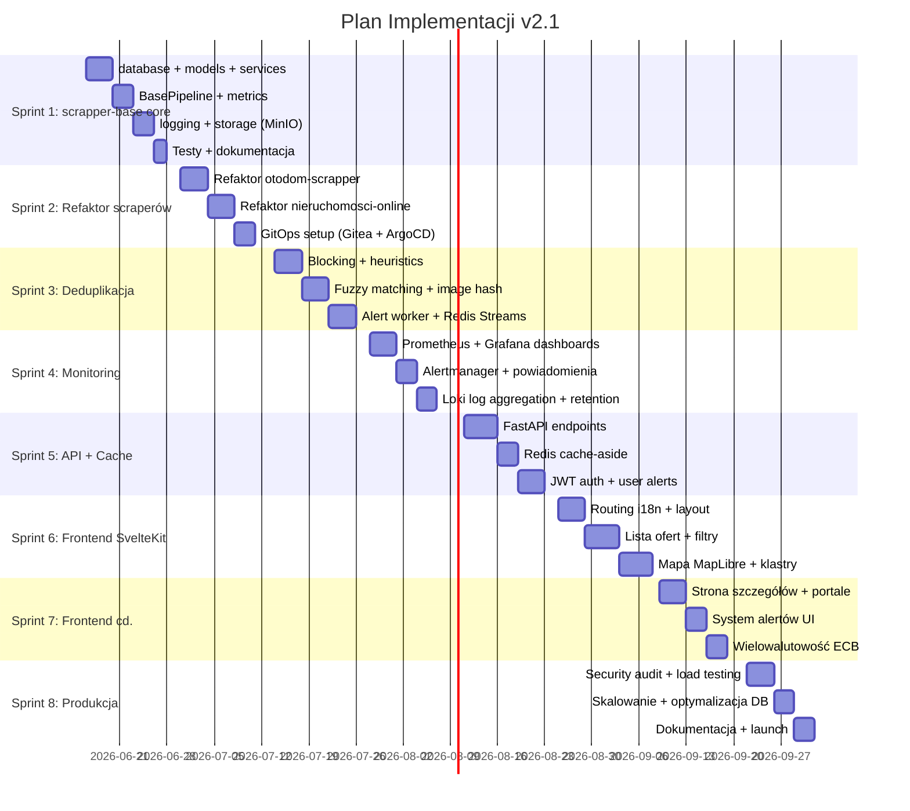

---

## 16. ⚠️ Ryzyka i Mitygacje

| Ryzyko | Prawdop. | Wpływ | Mitygacja |
|--------|----------|-------|-----------|
| Portal zmienia HTML | Wysokie | Wysoki | Selector health-check w CI, snapshot testy |
| IP ban przez portal | Wysokie | Średni | Stealth mode, random delays, rotating UA |
| Fałszywe duplikaty | Średnie | Średni | Score >= 0.85 + imageHash weryfikacja |
| PostgreSQL disk full | Niskie | Krytyczny | Alert @ 80%, auto-partycjonowanie |
| scrapper-base breaking change | Niskie | Wysoki | Semver + pinowanie wersji w requirements |
| Redis OOM | Niskie | Średni | maxmemory-policy allkeys-lru, alert @ 90% |
| Przekroczenie 16 GB RAM | Niskie | Wysoki | Monitoring RAM, alert @ 80%, możliwość dodania swapu |
| MinIO corruption             | Niskie   | Krytyczny | Erasure coding + daily backup do zewnętrznego  |
| GDPR — dane użytkowników | Średnie | Wysoki | Szyfrowanie PII, prawo do usunięcia, audit log |
| Konkurencja kopiuje dane | Średnie | Średni | Rate limiting API, CloudFlare bot protection |

---

## 17. 💰 Koszty Operacyjne (Self-Hosted)

| Składnik | Koszt miesięczny |
|----------|-----------------|
| VPS (Hetzner AX41, 32GB) | ~60 EUR |
| Cloudflare Free | 0 EUR |
| Gitea self-hosted | 0 EUR |
| PostgreSQL OSS | 0 EUR |
| Redis OSS | 0 EUR |
| MinIO OSS | 0 EUR |
| Grafana OSS | 0 EUR |
| **ŁĄCZNIE** | **~60 EUR/mies** |

---
