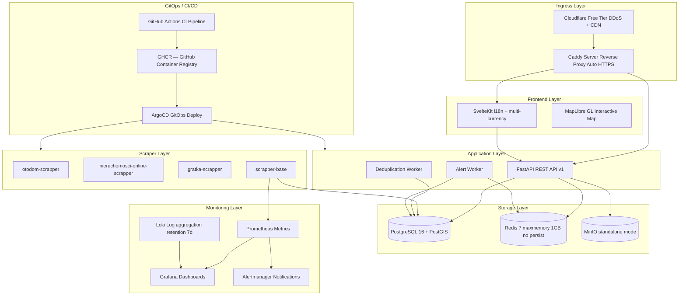
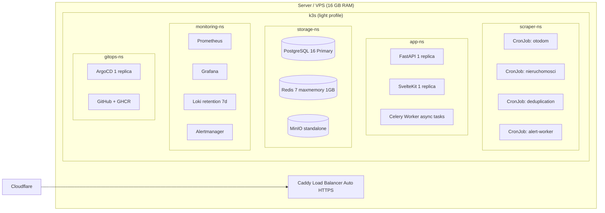

# 020 — ARCHITECTURE / System Architecture

## Metadata
- **Version:** 2.1
- **Status:** ready
- **Dependencies:** 010-VISION.md
- **AI Context:** Full system map, tech stack, hardware requirements, and all infrastructure diagrams.

---

## Full System Map



---

## Tech Stack (100% Open Source, Self-Hosted)



---

## k3s Installation

```bash
curl -sfL https://get.k3s.io | sh -s - \
  --disable=traefik \
  --disable=servicelb \
  --disable=local-storage \
  --disable=metrics-server \
  --flannel-backend=none \
  --write-kubeconfig-mode=644
```

---

## Hardware Requirements (Self-Hosted)

| Component | Minimum | Recommended | Rationale |
|-----------|---------|-------------|-----------|
| CPU | 4 cores | 8 cores | Playwright + k8s overhead |
| RAM | 16 GB | 32 GB | PostgreSQL + Redis + monitoring |
| OS Disk | 50 GB SSD | 100 GB NVMe | System + Docker images |
| Data Disk | 200 GB | 1 TB | PostgreSQL + MinIO photos |
| Network | 100 Mbps | 1 Gbps | Scraping + CDN |

---

## AI Implementation Notes

- Use this module for infrastructure-as-code decisions (k3s, Caddy, namespaces).
- Verify with: `kubectl get nodes`, `kubectl get ns`, `caddy version`.
- Related: 140-GITOPS-CICD.md, 070-DATABASE.md, 120-CACHING-STORAGE.md.
