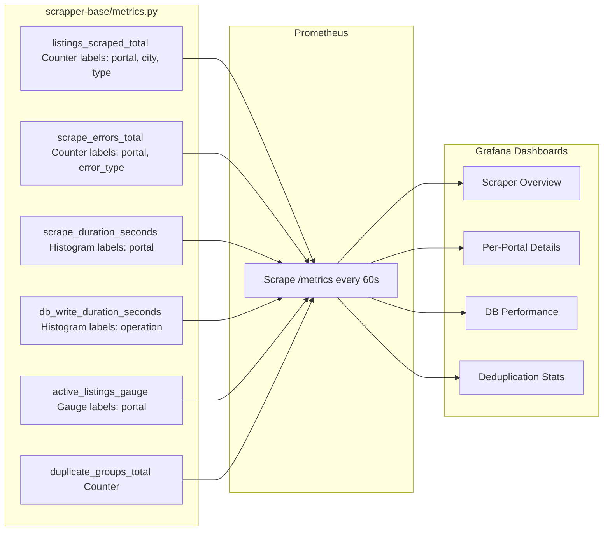

# 060 — SCRAPER-BASE / Base Pipeline, Deduplication & Scraper Framework

## Metadata
- **Version:** 2.1
- **Status:** ready
- **Dependencies:** 070-DATABASE.md, 120-CACHING-STORAGE.md
- **AI Context:** The core Python package that all scrapers depend on. AI agent should generate `scrapper-base/` package.

---

## User Stories Implemented

- SB-1 through SB-6 (Epic 1: scrapper-base Core)
- MT-1 through MT-6 (Epic 2: Scraper Metrics)

---

## Repository Structure

```
scrapper-base/                     ← pip package (private PyPI / Gitea)
├── scraper_base/
│   ├── __init__.py
│   ├── database.py               ← PostgreSQL + PostGIS connection
│   ├── models.py                 ← Property, Agency SQLAlchemy models
│   ├── services.py               ← upsert_property(), PropertyService
│   ├── pipeline.py               ← BasePipeline ABC
│   ├── metrics.py                ← Prometheus metrics
│   ├── logging_config.py         ← Structured JSON logging
│   ├── storage.py                ← MinIO client (photo upload/download)
│   └── deduplication/
│       ├── __init__.py
│       ├── pipeline.py           ← run_deduplication(df_a, df_b)
│       ├── blocking.py           ← Stage 1: grouping
│       ├── heuristics.py         ← Stage 2: price/area thresholds
│       ├── fuzzy_matching.py     ← Stage 3: RapidFuzz scoring
│       └── image_hashing.py      ← Stage 4: phash (optional)
├── tests/
├── pyproject.toml                ← scrapper-base==1.x.x
└── CHANGELOG.md
```

---

## Scraper Metrics — Prometheus



---

## Deduplication Pipeline

| Stage | File | Description |
|-------|------|-------------|
| 1 | `blocking.py` | Group similar properties by city + type + price range |
| 2 | `heuristics.py` | Apply price/area thresholds to filter candidates |
| 3 | `fuzzy_matching.py` | RapidFuzz scoring on title, address, description |
| 4 | `image_hashing.py` | Optional phash verification for photos |

---

## API Contract (for individual scraper repos)

Each scraper repo (e.g. `otodom-scrapper/`) depends on `scrapper-base>=1.0.0` and implements:

```python
from scraper_base import BasePipeline

class OtodomPipeline(BasePipeline):
    PORTAL_SOURCE = "otodom"

    def item_to_data(self, item) -> dict:
        """Convert Scrapy item to normalized property dict."""
        ...
```

---

## AI Implementation Notes

**Files to generate:**
- `scrapper-base/pyproject.toml`
- `scrapper-base/scraper_base/__init__.py`
- `scrapper-base/scraper_base/database.py` — asyncpg/psycopg2 connection pool
- `scrapper-base/scraper_base/models.py` — SQLAlchemy ORM models mirroring 070-DATABASE.md
- `scrapper-base/scraper_base/services.py` — `upsert_property()` with concurrent-write safety
- `scrapper-base/scraper_base/pipeline.py` — `BasePipeline` ABC
- `scrapper-base/scraper_base/metrics.py` — Prometheus client counters/histograms
- `scrapper-base/scraper_base/logging_config.py` — structured JSON logging
- `scrapper-base/scraper_base/storage.py` — MinIO client
- `scrapper-base/scraper_base/deduplication/*.py` — all 4 stages
- `scrapper-base/tests/` — pytest suite

**Verification:**
- `pytest tests/ -v --cov=. --cov-fail-under=80`
- `ruff check .`
- `mypy scraper_base/`

**Related modules:** 070-DATABASE.md (models + DB), 120-CACHING-STORAGE.md (MinIO + Redis streams), 130-MONITORING-ALERTS.md (metrics + alerts).

---

## FIX-1: Deduplication edge cases & concurrent-write safety

### Score threshold with hysteresis

| Score | Action |
|-------|--------|
| ≥ 0.85 | Merge into existing `duplicate_group_id` |
| 0.80 – 0.84 | Insert into `deduplication_candidates` (pending manual review) |
| < 0.80 | Treat as distinct property |

```python
DEDUP_MERGE_THRESHOLD = 0.85
DEDUP_CANDIDATE_THRESHOLD = 0.80  # "suspicious" — queue for review
```

### deduplication_candidates table

```sql
CREATE TABLE deduplication_candidates (
    id SERIAL PRIMARY KEY,
    property_id_a INTEGER NOT NULL REFERENCES properties(id),
    property_id_b INTEGER NOT NULL REFERENCES properties(id),
    fuzzy_score FLOAT NOT NULL,
    status VARCHAR(20) DEFAULT 'pending'  -- pending | merged | rejected
        CHECK (status IN ('pending','merged','rejected')),
    reviewed_by INTEGER REFERENCES users(id),
    reviewed_at TIMESTAMP,
    created_at TIMESTAMP DEFAULT NOW()
);
CREATE INDEX idx_dedup_candidates_status ON deduplication_candidates (status)
    WHERE status = 'pending';
```

### Concurrent-write safety (optimistic locking)

```python
# services.py — upsert_property() with optimistic lock on duplicate_group_id
async def assign_duplicate_group(
    session: AsyncSession,
    property_id: int,
    group_id: UUID,
    expected_updated_at: datetime,
) -> bool:
    """Returns False if another writer already updated the group (retry)."""
    result = await session.execute(
        update(DuplicateGroup)
        .where(
            DuplicateGroup.id == group_id,
            DuplicateGroup.updated_at == expected_updated_at,
        )
        .values(updated_at=func.now(), total_count=DuplicateGroup.total_count + 1)
    )
    return result.rowcount == 1  # 0 = stale, retry
```

### Selector health-check (FIX-9)

Add `BasePipeline.validate_selectors()` — called before every crawl:

```python
class BasePipeline(ABC):
    SELECTOR_FINGERPRINTS: dict[str, str] = {}  # {"listing_item": "sha256_of_html_structure"}

    async def validate_selectors(self, sample_url: str) -> None:
        """Fetch one page, compute structural fingerprint, compare to stored hash.
        Raises SelectorMismatchError if portal HTML changed."""
        html = await self._fetch(sample_url)
        fingerprint = self._compute_fingerprint(html)
        stored = self.SELECTOR_FINGERPRINTS.get("listing_item")
        if stored and fingerprint != stored:
            raise SelectorMismatchError(
                f"{self.PORTAL_SOURCE}: selector fingerprint changed "
                f"(stored={stored[:8]}, got={fingerprint[:8]}). "
                "Update selectors before scraping."
            )
```

CI job `selector-health-check` runs nightly:
```yaml
# .github/workflows/selector-health.yml
name: Selector health check
on:
  schedule:
    - cron: "0 5 * * *"   # 05:00 UTC, before scrapers at 02:00 local
jobs:
  check:
    runs-on: ubuntu-latest
    steps:
      - run: scrapy crawl search --dry-run -s CLOSESPIDER_PAGECOUNT=1
```

## FIX-7: Deduplication CronJob idempotency

Add `status` + `checkpoint_offset` to `scraper_runs` (or new `dedup_runs` table):

```sql
CREATE TABLE dedup_runs (
    id SERIAL PRIMARY KEY,
    started_at TIMESTAMP DEFAULT NOW(),
    finished_at TIMESTAMP,
    status VARCHAR(20) DEFAULT 'running'
        CHECK (status IN ('running','completed','failed')),
    checkpoint_offset INTEGER DEFAULT 0,  -- last processed property.id
    error_message TEXT
);
```

Pipeline startup logic:
```python
async def run_deduplication():
    last = await get_last_dedup_run()
    if last and last.status == 'running' and last.started_at < now() - timedelta(hours=2):
        # Stale run — resume from checkpoint
        offset = last.checkpoint_offset
    else:
        offset = 0
        await create_dedup_run()

    async for batch in fetch_properties_from(offset):
        await process_batch(batch)
        await update_checkpoint(batch[-1].id)

    await mark_dedup_run_completed()
```

k8s CronJob must include:
```yaml
spec:
  concurrencyPolicy: Forbid   # prevent parallel runs
  failedJobsHistoryLimit: 3
  successfulJobsHistoryLimit: 1
```
