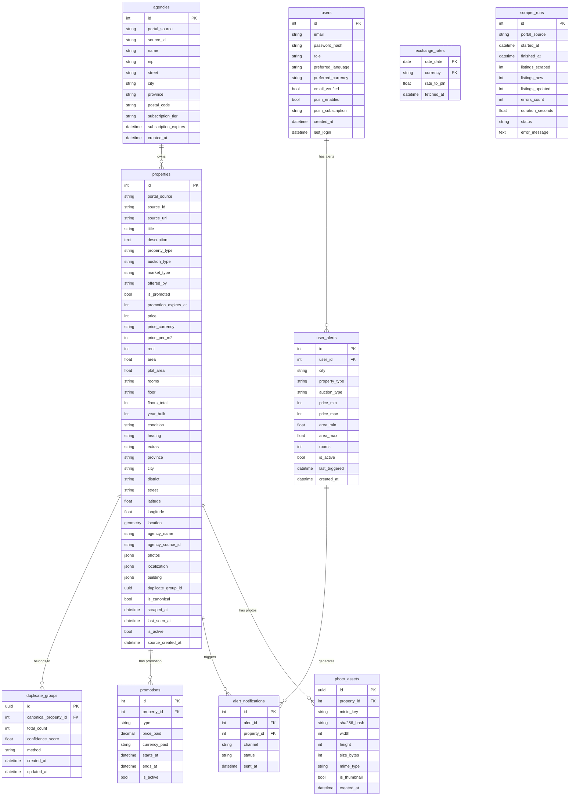

# 070 — DATABASE / Complete Schema, Partitioning & Indexes

## Metadata
- **Version:** 2.1
- **Status:** ready
- **Dependencies:** 020-ARCHITECTURE.md
- **AI Context:** Full database schema for PostgreSQL 16 + PostGIS. AI agent should generate SQL migrations and SQLAlchemy models.

---

## Entity Relationship Diagram



---

## Table: `properties` — Partitioning

```sql
CREATE TABLE properties (
    id SERIAL,
    portal_source VARCHAR(50),
    source_id VARCHAR(255),
    source_url TEXT,
    title VARCHAR(500),
    description TEXT,
    property_type VARCHAR(50),
    auction_type VARCHAR(20),
    market_type VARCHAR(20),
    offered_by VARCHAR(20),
    is_promoted BOOLEAN DEFAULT FALSE,
    promotion_expires_at TIMESTAMP,
    price INTEGER,
    price_currency VARCHAR(3) DEFAULT 'PLN',
    price_per_m2 INTEGER,
    rent INTEGER,
    area FLOAT,
    plot_area FLOAT,
    rooms VARCHAR(50),
    floor VARCHAR(50),
    floors_total INTEGER,
    year_built INTEGER,
    condition VARCHAR(50),
    heating VARCHAR(100),
    extras JSONB,
    province VARCHAR(100),
    city VARCHAR(100),
    district VARCHAR(100),
    street VARCHAR(255),
    latitude FLOAT,
    longitude FLOAT,
    location GEOMETRY(Point, 4326),
    agency_name VARCHAR(255),
    agency_source_id VARCHAR(255),
    photos JSONB,
    localization JSONB,
    building JSONB,
    duplicate_group_id UUID,
    is_canonical BOOLEAN DEFAULT FALSE,
    scraped_at TIMESTAMP DEFAULT NOW(),
    last_seen_at TIMESTAMP DEFAULT NOW(),
    is_active BOOLEAN DEFAULT TRUE,
    source_created_at TIMESTAMP,
    PRIMARY KEY (id, portal_source)
) PARTITION BY LIST (portal_source);

CREATE TABLE properties_otodom PARTITION OF properties FOR VALUES IN ('otodom');
CREATE TABLE properties_gratka PARTITION OF properties FOR VALUES IN ('gratka');
CREATE TABLE properties_nieruchomosci_online PARTITION OF properties FOR VALUES IN ('nieruchomosci-online');
CREATE TABLE properties_other PARTITION OF properties DEFAULT;
```

---

## Performance Indexes

```sql
-- Primary search index
CREATE INDEX CONCURRENTLY idx_properties_search
ON properties (city, property_type, auction_type, price)
WHERE is_canonical = true AND is_active = true;

-- PostGIS spatial index
CREATE INDEX CONCURRENTLY idx_properties_location
ON properties USING GIST (location)
WHERE is_canonical = true;
```

---

## Materialized View: Canonical Properties

```sql
CREATE MATERIALIZED VIEW canonical_properties AS
SELECT DISTINCT ON (duplicate_group_id) *
FROM properties
WHERE is_canonical = true
  AND is_active = true
ORDER BY duplicate_group_id, is_promoted DESC, scraped_at DESC;

-- Refresh after each scraping run
REFRESH MATERIALIZED VIEW CONCURRENTLY canonical_properties;
```

---

## AI Implementation Notes

**Files to generate:**
- `infrastructure/k8s/storage/postgres-statefulset.yaml`
- Database migration scripts (Alembic or raw SQL)
- SQLAlchemy models in `scrapper-base/scraper_base/models.py`
- Service layer in `scrapper-base/scraper_base/services.py`

**Verification:**
- `psql` connection test
- `pytest` with test database
- Migration up/down test

**Related modules:** 060-SCRAPER-BASE.md (models + services), 120-CACHING-STORAGE.md (Redis + MinIO), 150-SCALING.md (read replicas, partitioning).

---

## FIX-3: Unique index on canonical_properties (required for CONCURRENT refresh)

```sql
-- REQUIRED before first REFRESH MATERIALIZED VIEW CONCURRENTLY
-- Without this index, CONCURRENTLY mode raises:
--   ERROR: cannot refresh materialized view "canonical_properties" concurrently
-- and falls back to a full exclusive table lock.

CREATE UNIQUE INDEX idx_canonical_mv_pk
ON canonical_properties (id, portal_source);
```

> **Rule:** Always create this index immediately after `CREATE MATERIALIZED VIEW`,
> before the first data load. Add it to the Alembic migration that creates the view.

## FIX-10: photo_assets — max photos per property

```sql
-- Prevent runaway scrapers from flooding MinIO
ALTER TABLE photo_assets
  ADD CONSTRAINT chk_photo_limit
  CHECK (
    (SELECT COUNT(*) FROM photo_assets pa2
     WHERE pa2.property_id = photo_assets.property_id) <= 50
  );
```

> **BasePipeline constant (Python):**
> ```python
> MAX_PHOTOS_PER_PROPERTY: int = 20  # hard cap before DB insert
> ```
> Enforce in `storage.py` before calling `minio_client.put_object()`.

## FIX-14: scraper_runs — future range partitioning note

```sql
-- Current: unpartitioned (acceptable for Phase 1, ~1 000 rows/year)
-- Phase 2 migration (> 50 k rows):
-- CREATE TABLE scraper_runs (...)
--   PARTITION BY RANGE (started_at);
-- CREATE TABLE scraper_runs_2026 PARTITION OF scraper_runs
--   FOR VALUES FROM ('2026-01-01') TO ('2027-01-01');
-- (add yearly CronJob to create next partition in December)
```

## AI Implementation Notes (updated)

**Additional files / changes:**
- Add `idx_canonical_mv_pk` to Alembic migration for `canonical_properties`
- Add `chk_photo_limit` CHECK constraint migration
- Add `MAX_PHOTOS_PER_PROPERTY = 20` constant to `scraper_base/storage.py`
