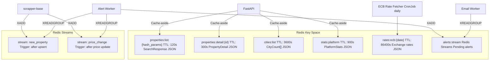
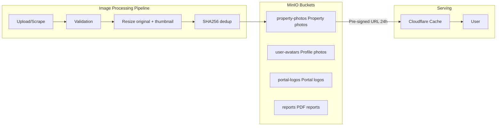

# 120 — CACHING-STORAGE / Redis Cache + MinIO Photo Storage

## Metadata
- **Version:** 2.1
- **Status:** ready
- **Dependencies:** 070-DATABASE.md
- **AI Context:** Redis cache-aside, Redis Streams for alerts, and MinIO object storage for photos. Implements Epics 5 (RC-1..5) and 6 (IMG-1..5).

---

## User Stories Implemented

- RC-1 through RC-5 (Epic 5: Redis Cache)
- IMG-1 through IMG-5 (Epic 6: Photo Storage)

---

## Redis Architecture — Cache + Streams



## Redis ConfigMap

```yaml
apiVersion: v1
kind: ConfigMap
metadata:
  name: redis-config
data:
  redis.conf: |
    maxmemory 1gb
    maxmemory-policy allkeys-lru
    save ""
    appendonly no
```

## Cache Strategy Matrix

| Cache Key | TTL | Populated By | Invalidated By |
|-----------|-----|-------------|---------------|
| `properties:list:{hash}` | 120s | API GET /properties | New property upsert |
| `properties:detail:{id}` | 300s | API GET /properties/{id} | Property update |
| `cities:list` | 3600s | API GET /cities | New property upsert |
| `stats:platform` | 900s | API GET /stats | Dedup run |
| `rates:ecb:{date}` | 86400s | CronJob (daily) | Time-based expiry |

---

## MinIO — Photo Storage Architecture



## MinIO Deployment (standalone)

```yaml
apiVersion: apps/v1
kind: StatefulSet
metadata:
  name: minio
spec:
  replicas: 1
  template:
    spec:
      containers:
      - name: minio
        image: minio/minio:latest
        args: ["server", "/data"]
        env:
        - name: MINIO_ROOT_USER
          value: "minioadmin"
        - name: MINIO_ROOT_PASSWORD
          value: "minioadmin123"
        volumeMounts:
        - name: data
          mountPath: /data
  volumeClaimTemplates:
  - metadata:
      name: data
    spec:
      accessModes: ["ReadWriteOnce"]
      resources:
        requests:
          storage: 200Gi
```

---

## AI Implementation Notes

**Files to generate:**
- Redis cache service: `real-estate-api/app/services/cache.py`
- Redis Stream publisher in scrapper-base
- Alert Worker (Redis Stream consumer)
- MinIO client in `scrapper-base/scraper_base/storage.py`
- Image processing pipeline (validation, resize, SHA256 dedup, thumbnail)
- `infrastructure/k8s/storage/redis-statefulset.yaml`
- `infrastructure/k8s/storage/minio-statefulset.yaml`
- Photo cleanup CronJob

**Verification:**
- `redis-cli PING` → PONG
- `mc ls local/property-photos` — MinIO reachable
- API response includes `X-Cache: hit/miss` header
- `pytest tests/` — cache fallback when Redis unavailable

**Related modules:** 080-API.md (cache-aside), 060-SCRAPER-BASE.md (stream publisher + MinIO storage), 070-DATABASE.md (photo_assets table).

---

## FIX-2: MinIO secrets — use Kubernetes Secrets (not hardcoded values)

Replace all hardcoded credentials in StatefulSet with Secret references:

```yaml
# infrastructure/k8s/storage/minio-secret.yaml
apiVersion: v1
kind: Secret
metadata:
  name: minio-credentials
  namespace: storage-ns
type: Opaque
stringData:
  root-user: "CHANGE_ME"       # set via CI secret / External Secrets Operator
  root-password: "CHANGE_ME"   # min 16 chars, rotate every 90 days
```

```yaml
# minio-statefulset.yaml — replace env.value with secretKeyRef
env:
- name: MINIO_ROOT_USER
  valueFrom:
    secretKeyRef:
      name: minio-credentials
      key: root-user
- name: MINIO_ROOT_PASSWORD
  valueFrom:
    secretKeyRef:
      name: minio-credentials
      key: root-password
```

### Bucket-level RBAC policy

```json
{
  "scraper-policy": {
    "actions": ["s3:PutObject"],
    "resources": ["arn:aws:s3:::property-photos/*"]
  },
  "api-policy": {
    "actions": ["s3:GetObject"],
    "resources": ["arn:aws:s3:::property-photos/*", "arn:aws:s3:::portal-logos/*"]
  },
  "admin-policy": {
    "actions": ["s3:*"],
    "resources": ["arn:aws:s3:::*"]
  }
}
```

Apply with `mc admin policy create` in a post-install Job. Rotate root password via CronJob every 90 days (update Secret → rolling restart MinIO pod).

---

## FIX-4: Redis Streams — MAXLEN, dead-letter policy, consumer group cleanup

### Stream size caps

```python
# All XADD calls must include MAXLEN to prevent unbounded growth
await redis.xadd(
    "stream:new_property",
    fields={"data": payload},
    maxlen=10_000,   # trim to ~10k messages (~last 3-4 days at normal volume)
    approximate=True,
)
await redis.xadd(
    "stream:alerts:pending",
    fields={"data": payload},
    maxlen=5_000,
    approximate=True,
)
```

### Retry + dead-letter policy

```python
MAX_RETRIES = 3
DEAD_LETTER_STREAM = "stream:dead_letter"
DEAD_LETTER_TTL_SECONDS = 7 * 24 * 3600  # 7 days (matches Loki retention)

async def process_with_retry(stream: str, group: str, msg_id: str, data: dict):
    retries = int(data.get("_retries", 0))
    try:
        await handle_message(data)
        await redis.xack(stream, group, msg_id)
    except Exception as exc:
        if retries >= MAX_RETRIES:
            await redis.xadd(DEAD_LETTER_STREAM, {
                "origin_stream": stream,
                "msg_id": msg_id,
                "error": str(exc),
                "data": json.dumps(data),
            }, maxlen=1_000)
            await redis.xack(stream, group, msg_id)
        else:
            data["_retries"] = retries + 1
            await redis.xadd(stream, data)   # re-enqueue
            await redis.xack(stream, group, msg_id)
```

### Consumer group cleanup CronJob

```yaml
# infrastructure/k8s/scrapers/redis-gc-cronjob.yaml
schedule: "0 3 * * *"   # nightly at 03:00
command:
  - python
  - -c
  - |
    # Delete consumers idle > 24h in all groups
    for stream in ["stream:new_property", "stream:alerts:pending"]:
        groups = redis.xinfo_groups(stream)
        for g in groups:
            consumers = redis.xinfo_consumers(stream, g["name"])
            for c in consumers:
                if c["idle"] > 86_400_000:   # ms
                    redis.xgroup_delconsumer(stream, g["name"], c["name"])
```
