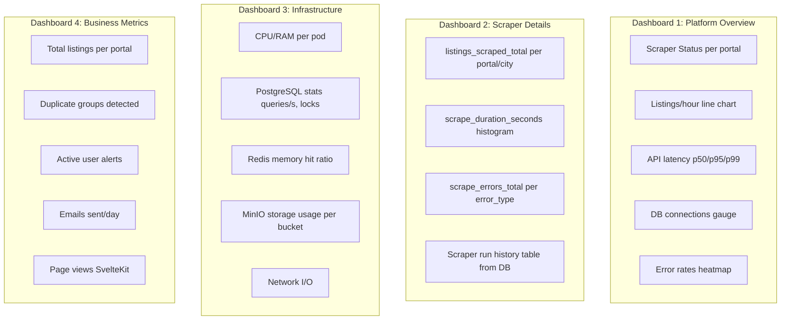
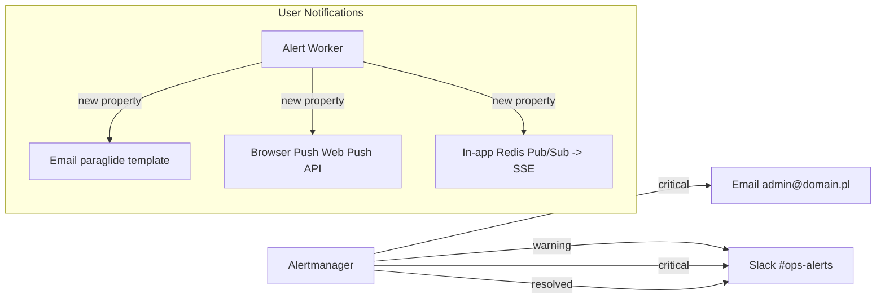

# 130 — MONITORING-ALERTS / Monitoring, Alerting & Notifications

## Metadata
- **Version:** 2.1
- **Status:** ready
- **Dependencies:** 020-ARCHITECTURE.md, 060-SCRAPER-BASE.md
- **AI Context:** Complete monitoring stack — Prometheus, Grafana, Loki, Alertmanager. Implements Epics 9 (ALT) and 10 (MON).

---

## User Stories Implemented

- MT-5, MT-6 (Scraper Metrics → Grafana + alerts)
- ALT-1 through ALT-5 (User alerts + admin notifications)
- MON-1 through MON-6 (Infrastructure + API monitoring)

---

## Grafana Dashboards



---

## Alertmanager Rules

```yaml
# alertmanager-rules.yaml
groups:
  - name: scrapers
    rules:
      - alert: ScraperHighErrorRate
        expr: |
          rate(scrape_errors_total[15m]) /
          rate(listings_scraped_total[15m]) > 0.05
        for: 15m
        labels:
          severity: warning
        annotations:
          summary: "Scraper {{ $labels.portal }} error rate > 5%"
          description: "Error rate: {{ $value | humanizePercentage }}"

      - alert: ScraperNotRunning
        expr: |
          time() - scraper_last_run_timestamp > 86400
        labels:
          severity: critical
        annotations:
          summary: "Scraper {{ $labels.portal }} not run > 24h"

  - name: infrastructure
    rules:
      - alert: PostgreSQLHighConnections
        expr: pg_stat_activity_count > 80
        labels:
          severity: warning

      - alert: DiskSpaceCritical
        expr: |
          (node_filesystem_avail_bytes / node_filesystem_size_bytes) < 0.20
        labels:
          severity: critical

      - alert: RedisMemoryHigh
        expr: redis_memory_used_bytes / redis_memory_max_bytes > 0.90
        labels:
          severity: warning

      - alert: APIHighLatency
        expr: |
          histogram_quantile(0.95,
            rate(http_request_duration_seconds_bucket[5m])
          ) > 0.5
        labels:
          severity: warning

      - alert: ContainerCrashLooping
        expr: rate(kube_pod_container_status_restarts_total[15m]) > 0
        labels:
          severity: critical
```

---

## Notification Channels



---

## Loki Configuration (7-day retention)

```yaml
limits_config:
  max_lookback_period: 168h
  retention_period: 168h
```

---

## Acceptance Criterion: MT-5

```gherkin
Given scraper uruchomiony dla portalu "otodom"
And scraper zakończył sesję scrapowania

When admin otwiera Grafana dashboard "Scrapers Overview"

Then widzi wykres listings_scraped_total z podziałem per portal
And widzi histogram scrape_duration_seconds (p50, p95, p99)
And widzi alert jeśli error_rate > 5% przez ostatnie 15 minut
And dane są odświeżane co 30 sekund
```

---

## AI Implementation Notes

**Files to generate:**
- `infrastructure/monitoring/prometheus-config.yaml`
- `infrastructure/monitoring/grafana-deployment.yaml`
- `infrastructure/monitoring/grafana-dashboards/` — JSON dashboard definitions for all 4 dashboards
- `infrastructure/monitoring/alertmanager-config.yaml`
- `infrastructure/monitoring/loki-config.yaml`
- User alert system: Alert Worker consuming Redis Streams
- Email delivery service (SMTP)
- Browser push notification service (Web Push API)
- `infrastructure/k8s/monitoring/` — namespace manifests

**Verification:**
- Prometheus: `curl http://localhost:9090/api/v1/targets` — all targets UP
- Grafana: `curl http://localhost:3000/api/health` — OK
- Alertmanager: `curl http://localhost:9093/api/v2/alerts` — no critical alerts
- Loki: log query returns results
- Send test alert → email delivered

**Related modules:** 060-SCRAPER-BASE.md (metrics emission), 120-CACHING-STORAGE.md (Redis Streams for user alerts), 140-GITOPS-CICD.md (GitOps for monitoring config), 020-ARCHITECTURE.md (monitoring namespace).

---

## FIX-12: Service Level Objectives (SLO)

### SLO definitions

| Service | Metric | SLO | Window | Alert threshold |
|---------|--------|-----|--------|-----------------|
| API | Availability | ≥ 99.5% | 30d | < 99.0% → critical |
| API | p95 latency | ≤ 500ms | 7d | > 500ms → warning |
| API | p99 latency | ≤ 2000ms | 7d | > 2000ms → critical |
| Scrapers | Success rate | ≥ 95% | 7d | < 95% → warning |
| Alert delivery | Delay | ≤ 5 min | — | > 5 min → warning |
| Data freshness | New listings/day | ≥ 100 | 7d | < 100 → warning |

### SLO Prometheus recording rules

```yaml
# infrastructure/monitoring/slo-rules.yaml
groups:
  - name: slo
    interval: 1m
    rules:
      - record: slo:api_availability:rate5m
        expr: |
          sum(rate(http_requests_total{status!~"5.."}[5m]))
          / sum(rate(http_requests_total[5m]))

      - record: slo:api_p95_latency:rate5m
        expr: |
          histogram_quantile(0.95,
            sum(rate(http_request_duration_seconds_bucket[5m])) by (le))

      - alert: SLOAPIAvailabilityBreach
        expr: slo:api_availability:rate5m < 0.99
        for: 5m
        labels:
          severity: critical
        annotations:
          summary: "API availability SLO breach (< 99%)"

      - alert: SLOScraperSuccessRateBreach
        expr: |
          (1 - rate(scrape_errors_total[7d]) / rate(listings_scraped_total[7d])) < 0.95
        for: 1h
        labels:
          severity: warning
        annotations:
          summary: "Scraper success rate below SLO (< 95%)"
```

### Error budget tracking

Add to Grafana Dashboard 4 "Business Metrics":
- Error budget remaining (30d): `(actual_uptime - SLO_target) / (1 - SLO_target) * 100%`
- Burn rate gauge: alert when budget burn rate > 2× normal
