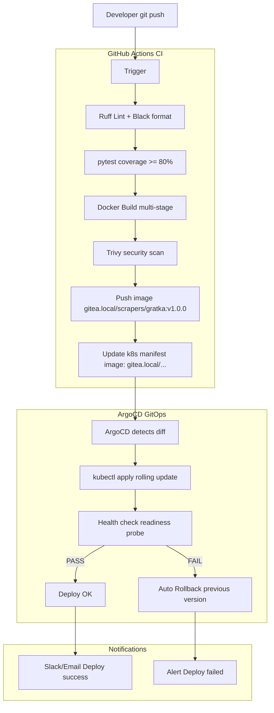

# 140 — GITOPS-CICD / GitOps & CI/CD Pipeline

## Metadata
- **Version:** 2.1
- **Status:** ready
- **Dependencies:** 020-ARCHITECTURE.md
- **AI Context:** Complete CI/CD pipeline with GitHub Actions, ArgoCD, Gitea Registry, and Kubernetes manifests. Implements Epic 4 (CI-1 through CI-5).

---

## User Stories Implemented

- CI-1 through CI-5 (Epic 4: GitOps + CI/CD)

---

## Workflow Diagram



---

## GitHub Actions Workflow

```yaml
# .github/workflows/ci.yml
name: CI/CD Pipeline

on:
  push:
    branches: [main]
  pull_request:
    branches: [main]

jobs:
  test:
    runs-on: ubuntu-latest
    steps:
      - uses: actions/checkout@v4
      - name: Lint (Ruff + Black)
        run: ruff check . && black --check .
      - name: Test (pytest)
        run: pytest --cov=. --cov-fail-under=80
      - name: Type check (mypy)
        run: mypy scraper_base/

  build-and-push:
    needs: test
    if: github.ref == 'refs/heads/main'
    steps:
      - name: Build Docker image
        run: docker build -t gitea.local/${{ github.repository }}:${{ github.sha }} .
      - name: Trivy security scan
        uses: aquasecurity/trivy-action@master
        with:
          exit-code: '1'
          severity: 'CRITICAL'
      - name: Push to Gitea Registry
        run: docker push gitea.local/${{ github.repository }}:${{ github.sha }}
      - name: Update k8s manifests
        run: |
          sed -i "s|image:.*|image: gitea.local/${{ github.repository }}:${{ github.sha }}|" \
            k8s/app/fastapi-deployment.yaml
          git commit -am "ci: update image to ${{ github.sha }}"
          git push
```

---

## Kubernetes Manifest Structure

```
k8s/
├── namespaces/
│   ├── scrapers.yaml
│   ├── app.yaml
│   ├── storage.yaml
│   └── monitoring.yaml
├── scrapers/
│   ├── otodom-cronjob.yaml        # schedule: "0 2 * * *"
│   ├── nieruchomosci-cronjob.yaml # schedule: "30 2 * * *"
│   └── deduplication-cronjob.yaml # schedule: "0 6 * * *"
├── app/
│   ├── fastapi-deployment.yaml    # 1 replica
│   ├── sveltekit-deployment.yaml  # 1 replica
│   ├── alert-worker-deployment.yaml
│   └── services.yaml
├── storage/
│   ├── postgres-statefulset.yaml
│   ├── redis-statefulset.yaml
│   └── minio-statefulset.yaml
├── monitoring/
│   ├── prometheus-config.yaml
│   ├── grafana-deployment.yaml
│   ├── loki-config.yaml
│   └── alertmanager-config.yaml
└── argocd/
    ├── app-of-apps.yaml
    └── applications/
        ├── scrapers-app.yaml
        ├── backend-app.yaml
        └── monitoring-app.yaml
```

---

## Minimal ArgoCD Installation

```bash
kubectl create ns argocd
kubectl apply -n argocd -f https://raw.githubusercontent.com/argoproj/argo-cd/stable/manifests/install.yaml
kubectl patch deployment argocd-server -n argocd -p '{"spec":{"replicas":1}}'
kubectl patch deployment argocd-redis -n argocd -p '{"spec":{"replicas":0}}'
kubectl delete deployment argocd-dex-server -n argocd
```

---

## AI Implementation Notes

**Files to generate:**
- `.github/workflows/ci.yml` — for each repo (scrapper-base, scrapers, api, frontend)
- `infrastructure/k8s/` — all Kubernetes manifests above
- `infrastructure/argocd/` — ArgoCD Application definitions
- `infrastructure/helm/` — optional Helm charts
- Dockerfile for each service

**Verification:**
- `docker build . -t test` — builds successfully
- `kubectl get pods -n argocd` — ArgoCD running
- `argocd app list` — applications synced
- GitHub Actions run passes CI pipeline

**Related modules:** 020-ARCHITECTURE.md (k3s setup), 060-SCRAPER-BASE.md (scraper Dockerfiles), 080-API.md (API Dockerfile), 090-FRONTEND.md (frontend Dockerfile).

---

## FIX-7: CronJob concurrency & rollback labels

### All scraper and deduplication CronJobs must include

```yaml
spec:
  concurrencyPolicy: Forbid          # prevent parallel runs of same job
  failedJobsHistoryLimit: 3
  successfulJobsHistoryLimit: 1
  startingDeadlineSeconds: 300       # skip if delayed > 5 min
```

### Image rollback labels (FIX-13)

Every Deployment and CronJob manifest must carry a `rollback` annotation with the previous image:

```yaml
metadata:
  annotations:
    kubectl.kubernetes.io/last-applied-configuration: ""   # managed by ArgoCD
    bigpickle/previous-image: "gitea.local/scrapers/otodom:{{ previous_sha }}"
```

ArgoCD rollback one-liner (add to runbook):
```bash
argocd app rollback <app-name> --revision <previous-revision>
```

Manual image pin rollback:
```bash
kubectl set image cronjob/otodom-scrapper \
  otodom=gitea.local/scrapers/otodom:<previous_sha> -n scrapers-ns
```

## FIX-13: AGENTS.md verification checklist additions

Add to section 9 "After Coding — Verification Checklist":

```
[ ] Are changes reversible without a data migration?
[ ] If DB migration — does a `down` revision exist? (alembic downgrade -1 tested)
[ ] Is the previous image SHA noted in the deployment annotation for fast rollback?
[ ] If CronJob — is concurrencyPolicy: Forbid set?
[ ] Do all new Secrets use secretKeyRef (never env.value for credentials)?
```
