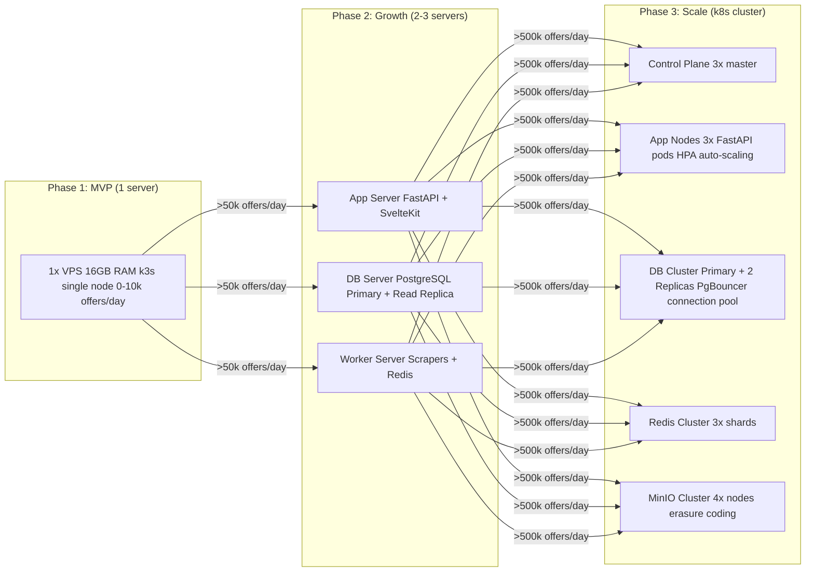

# 150 — SCALING / Scaling Strategies

## Metadata
- **Version:** 2.1
- **Status:** ready
- **Dependencies:** 020-ARCHITECTURE.md, 070-DATABASE.md, 120-CACHING-STORAGE.md
- **AI Context:** Scaling strategy across 3 phases: MVP → Growth → Scale. Implements Epic 8 (SC-1 through SC-4).

---

## User Stories Implemented

- SC-1 through SC-4 (Epic 8: Scaling)

---

## Scaling Phases



---

## Per-Component Strategy

| Component | Phase 1 | Phase 2 | Phase 3 |
|-----------|---------|---------|---------|
| **FastAPI** | 1 instance | 2 instances | HPA: 2-10 pods |
| **PostgreSQL** | 1 node | Primary + Read Replica | Primary + 2 Replicas + PgBouncer |
| **Redis** | 1 node, maxmemory 1GB | Sentinel (HA) | Redis Cluster (3 shards) |
| **MinIO** | 1 node (standalone) | 2 nodes erasure | 4+ nodes distributed |
| **Scrapers** | k8s CronJob | k8s CronJob | k8s CronJob + parallelism |
| **SvelteKit** | 1 instance | 2 instances | CDN pre-rendering |
| **Monitoring** | 1 node, scrape 60s | 1 node | Thanos (long-term storage) |

---

## Database Optimizations

```sql
-- Primary search index (Phases 1-3)
CREATE INDEX CONCURRENTLY idx_properties_search
ON properties (city, property_type, auction_type, price)
WHERE is_canonical = true AND is_active = true;

-- PostGIS spatial index (Phases 1-3, critical for map queries)
CREATE INDEX CONCURRENTLY idx_properties_location
ON properties USING GIST (location)
WHERE is_canonical = true;

-- Materialized view for canonical listing (avoids dedup on every query)
CREATE MATERIALIZED VIEW canonical_properties AS
SELECT DISTINCT ON (duplicate_group_id) *
FROM properties
WHERE is_canonical = true
  AND is_active = true
ORDER BY duplicate_group_id, is_promoted DESC, scraped_at DESC;

REFRESH MATERIALIZED VIEW CONCURRENTLY canonical_properties;
```

---

## AI Implementation Notes

- **Phase 1** is the initial implementation target (this sprint).
- No separate code generation — use this module to inform architecture decisions in other modules.
- Key actions per phase:
  - **Phase 1:** Single-node k3s, all-in-one (default)
  - **Phase 2:** Split services across nodes, add read replica
  - **Phase 3:** Full HA, HPA, cluster mode

**Verification:** Load test with k6 or locust to validate Phase 1 meets 10k offers/day.
