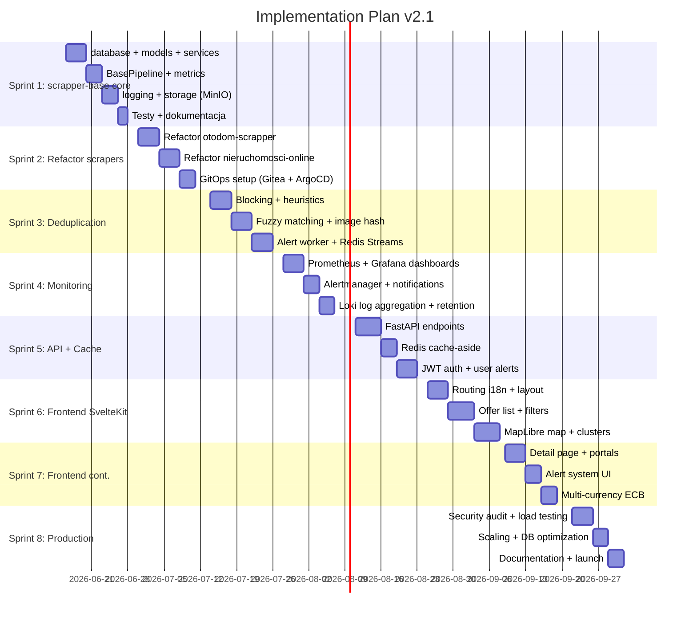

# 160 — SPRINT-PLAN / Implementation Timeline

## Metadata
- **Version:** 2.1
- **Status:** ready
- **Dependencies:** all modules (indexed view)
- **AI Context:** 8-sprint implementation plan with Gantt chart. Use for project management and milestone tracking.

---

---

## Sprint ⇄ Module Mapping

| Sprint | Modules | Focus |
|--------|---------|-------|
| 1 | 060, 070, 120 | scrapper-base core, DB schema, MinIO storage |
| 2 | 060 (scrapers), 140 | Individual scrapers, GitOps infra |
| 3 | 060 (dedup) | Deduplication pipeline, alert worker |
| 4 | 130 | Complete monitoring stack |
| 5 | 080, 120 | FastAPI endpoints, Redis cache |
| 6 | 090, 100, 110 | SvelteKit, map, i18n basics |
| 7 | 090, 110, 100 | Frontend details, alerts UI, currency |
| 8 | 150, 170, all | Security, scaling, launch |

---

## AI Implementation Notes

- **Current date:** 2026-06-16 (Sprint 1 start)
- Each sprint maps to specific modules — AI agents can work per-sprint
- Sprint 1 is the priority: scrapper-base foundation
- Use this as a roadmap, not a strict schedule

---

## FIX-15: Sprint 3 — Alert Worker test allocation

Sprint 3 original allocation: "Alert worker + Redis Streams (4 days)"

**Revised allocation:**

| Task | Days |
|------|------|
| Alert Worker implementation (Redis Stream consumer) | 2.5 |
| Tests: Alert Worker (fakeredis mock, end-to-end ALT-2 scenario) | 1.5 |

Test files to create in Sprint 3:
- `tests/test_alert_worker.py` — unit tests with `fakeredis.aioredis.FakeRedis`
- `tests/test_alt2_e2e.py` — Gherkin scenario ALT-2 (new property → email delivered in < 5 min)

Acceptance: `pytest tests/test_alert_worker.py tests/test_alt2_e2e.py -v --cov=alert_worker --cov-fail-under=80`

> Rationale: AGENTS.md states "Tests are first-class — every function/endpoint gets a pytest unit test. No exceptions." The original Sprint 3 plan had no explicit test time for the Alert Worker.
